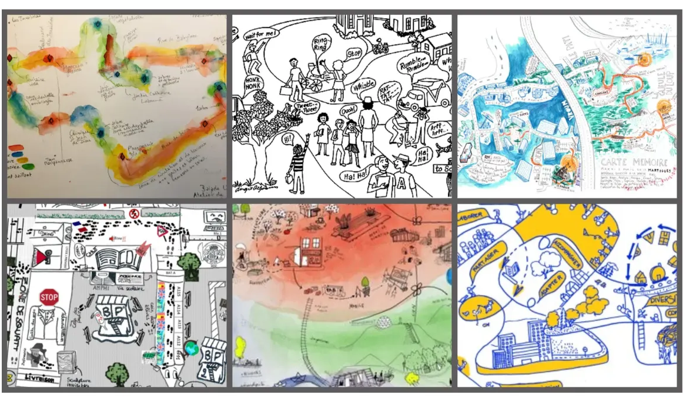

# S’initier à la cartographie sensible

> **La cartographie sensible est une méthode de représentation spatiale qui privilégie l'expérience émotionnelle et sensorielle plutôt que la description géographique objective. Elle fonctionne comme une maquette bidimensionnelle des perceptions et des émotions, révélant des enjeux territoriaux souvent invisibles dans les approches cartographiques traditionnelles. Au sein de SteamCity, elle constitue un outil de maquettage conceptuel qui prépare l'investigation terrain en matérialisant, dans un contexte de liberté d'expression personnelle, les ressentis individuels face à un territoire donné.**

La cartographie sensible se définit comme une méthode de représentation spatiale qui s'affranchit délibérément des contraintes de la cartographie classique pour capturer la dimension sensible et affective de l'expérience humaine face à l'environnement. Cette approche phénoménologique considère que la compréhension d'un espace ne peut se limiter à ses caractéristiques physiques mesurables, mais doit intégrer les émotions, les perceptions et les représentations que développent les individus face aux enjeux territoriaux.

**Le principe est simple : à partir de l'expérience vécue du territoire, les élèves créent une représentation graphique libre qui matérialise leurs émotions et leurs perceptions. Contrairement aux cartes géographiques traditionnelles, la cartographie sensible privilégie l'expression créative et la fidélité au ressenti plutôt que la précision géographique, révélant ainsi la complexité des rapports affectifs au territoire.**

> 🧙
> ### **Utiliser la cartographie sensible en animation**
> Les jeunes évoluent quotidiennement dans leur environnement sans toujours prendre conscience de leurs perceptions et émotions face au territoire. **La cartographie sensible transforme cette expérience inconsciente en démarche réflexive** en permettant aux participants d'identifier, de nommer et de représenter leurs ressentis face aux lieux qu'ils fréquentent. Cette approche révèle la richesse des perceptions individuelles - chaque représentation personnelle enrichit la compréhension collective du territoire - tout en développant une culture de l'observation sensible et de l'analyse critique de l'environnement. L'outil répond à un besoin concret de l'animation : faire émerger les représentations territoriales et les rendre visibles pour tous. Que ce soit pour révéler les ambiances sonores, identifier les espaces de bien-être et de stress, cartographier les peurs urbaines ou analyser les trajectoires émotionnelles, la cartographie sensible donne une légitimité aux perceptions en transformant les expériences subjectives en données d'analyse territoriale. Les participants découvrent qu'ils possèdent une expertise sensible de leur cadre de vie, développant ainsi une conscience territoriale ancrée dans leur réalité émotionnelle.
> **Concrètement**
> - **Légitimation du ressenti** : Les participants découvrent que leurs émotions et perceptions constituent des données légitimes pour comprendre un territoire, valorisant leur expertise d'usage et leur connaissance sensible.
> - **Expression créative libre** : L'outil permet une grande liberté graphique qui s'affranchit des codes cartographiques traditionnels, favorisant l'expression personnelle et la créativité individuelle.
> - **Révélation des enjeux invisibles** : Les cartes sensibles font émerger des problématiques territoriales souvent occultées par les approches techniques : zones d'angoisse, refuges émotionnels, variations d'ambiance.
> - **Construction d'une culture de l'observation** : En cartographiant leurs ressentis, les jeunes développent une attention particulière aux ambiances et aux atmosphères, enrichissant leur rapport sensible à l'environnement.

# **Tutoriel pratique - Structurer la démarche**

### **1. Passer d’un questionnement à une approche sensible du terrain**

Cette phase constitue une transition entre les questions que vous vous posez sur le territoire et l'exploration concrète. **Elle permet d'appréhender le territoire par les émotions avant d'aller l'observer sur le terrain.**

Discutez de vos interrogations par rapport au thème de votre atelier ou de votre projet (est-ce que je ressens du stress dans mon quartier, où ai-je l’impression de voir des oiseaux ou de la biodiversité, est-ce que certaines zones me paraissent trop bruyantes …). Organisez ensuite une discussion ouverte en posant des questions telles que "Comment ces questions résonnent-elles avec votre quotidien ?" ou "Avez-vous déjà vécu des situations liées à ces sujets ?". Invitez les jeunes à verbaliser spontanément leurs perceptions du territoire d'étude et leurs émotions associées à certains lieux, sans contrainte de forme ou de contenu.

Facilitez cette expression en reformulant les témoignages et en valorisant chaque contribution avec des relances comme "Tu nous dis que ce carrefour te stresse, peux-tu nous expliquer pourquoi ?". Présentez enfin la cartographie sensible comme un moyen de dessiner graphiquement ces perceptions pour préparer l'exploration terrain, en précisant qu'il n'y a pas de "bonne" ou "mauvaise" façon de représenter ses ressentis.

### **2. Créer sa cartographie sensible individuelle**

Cette phase de création permet à chaque jeune d'exprimer graphiquement ses ressentis territoriaux en toute liberté créative.

**Proposez du papier blanc, coloré, ou utilisez une carte existante comme base à annoter, et mettez à disposition un matériel varié comprenant crayons, feutres, pastels, gommettes, magazines à découper. La consigne reste ouverte : "Représentez votre environnement en montrant ce que vous ressentez dans les différents lieux". Précisez qu'il n'y a pas d'échelle à respecter, pas d'orientation imposée, pas de légende obligatoire, en accordant 30 à 45 minutes pour permettre l'expression créative complète.**

Les techniques de représentation peuvent inclure des **couleurs émotionnelles associées aux ressentis** (rouge pour le stress, vert pour l'apaisement), des **tracés expressifs** utilisant la forme des lignes pour traduire les sensations (zigzags pour l'agitation, courbes pour la douceur), des **symboles personnels** créés pour représenter des ambiances spécifiques, des annotations libres ajoutant mots, phrases ou onomatopées, ou encore des collages intégrant images et textures pour enrichir l'expression.

### **3. Partager et analyser collectivement**

Cette étape permet de confronter les représentations individuelles pour construire une compréhension collective du territoire.

Organisez l'accrochage de toutes les cartes pour permettre une **vision d'ensemble**, puis proposez un tour de présentation où chaque jeune explique sa carte en détaillant ses choix graphiques et ses ressentis. Le groupe identifie ensuite les points communs en repérant les lieux ou situations qui génèrent des émotions similaires chez plusieurs participants, explore les différences pour comprendre pourquoi certains espaces provoquent des ressentis différents selon les individus, et note les nouvelles questions qui naissent de cette confrontation des perceptions.

### **4. Faire le lien avec le terrain**

Cette phase finale articule les découvertes sensibles avec le terrain - d’autant plus intéressante si à la suite de la cartographie sensible, vous prévoyez une étude à l’extérieur.

Aidez le groupe à faire une synthèse collective en identifiant sur une carte géographique les secteurs à fort impact émotionnel révélés par les cartes individuelles, classez les émotions exprimées par grandes catégories (sécurité/insécurité, confort/inconfort), et reformulez les questions de départ en intégrant les dimensions sensibles découvertes. Définissez ensuite des éléments qualitatifs à observer sur le terrain.

# **Idées de projets jeunesse utilisant la cartographie sensible**

**Format de projets court (de quelques heures à quelques jours)**

| **"Cartographie des sons" - 8-14 ans** | **"Où je me sens bien, où je me sens mal" - 12-17 ans** | **"Mon quartier à travers mes émotions" - 10-16 ans** |
| --- | --- | --- |
| Les jeunes explorent leur environnement en se concentrant uniquement sur l'univers sonore, créent des cartes où les couleurs et les formes traduisent les ambiances acoustiques (rouge pour les zones bruyantes, bleu pour le calme), puis partagent leurs "paysages sonores" en expliquant leurs choix créatifs. | Projet direct sur les émotions spatiales où les participants identifient leurs zones de confort et d'inconfort, les représentent graphiquement avec leurs codes personnels, puis analysent collectivement les patterns qui émergent pour comprendre ce qui crée du bien-être ou de l'anxiété dans l'espace urbain | **Premier jour** : balade découverte du territoire avec prise de notes spontanées des ressentis. 
**Deuxième jour** : création individuelle des cartes sensibles avec techniques libres (dessin, collage, couleurs). 
**Troisième jour** : exposition des cartes et discussion collective sur les découvertes communes et les différences de perception. |

**Format de projets moyen (1 à 2 semaines)**

| **"Atlas du bonheur local" - 11-16 ans** | **"Géographie des peurs urbaines" - 13-18 ans** | **"Parcours de vie quotidienne" - 10-15 ans** |
| --- | --- | --- |
| **Première semaine** : exploration systématique du territoire à la recherche des "lieux de bonheur" avec documentation photographique et prise de notes. 
**Deuxième semaine** : création d'un atlas collectif mêlant cartes individuelles et synthèse de groupe, avec présentation finale aux habitants du quartier. | Les jeunes cartographient leurs appréhensions spatiales (peurs, angoisses, zones évitées), analysent les causes de ces ressentis, créent des cartes sensibles révélant la géographie émotionnelle de leur territoire, puis proposent des pistes d'amélioration des espaces problématiques. | Cartographie sensible des trajets réguliers (maison-école, maison-activités) en révélant les micro-événements émotionnels, les variations d'ambiance selon les moments de la journée, la saisonnalité des ressentis, avec création d'un carnet de route illustré. |

**Format de projets long (3 à 4 semaines)**

| **"Observatoire émotionnel du territoire" - 14-18 ans** | **"Mémoire sensible du quartier" - 12-17 ans** | **"Territoire idéal" - 11-16 ans** |
| --- | --- | --- |
| Projet de recherche participative où les jeunes deviennent "chercheurs en émotions urbaines" : constitution d'un protocole d'observation, relevés réguliers des ambiances par secteur géographique, création d'une base de données sensibles, analyse des résultats et restitution aux acteurs locaux. | Collecte des récits d'habitants sur leurs souvenirs émotionnels des lieux, croisement avec les perceptions actuelles des jeunes, création de cartes temporelles montrant l'évolution sensible du territoire, exposition intergénérationnelle mélangeant témoignages et cartographies sensibles. | À partir des cartes sensibles du territoire existant, les jeunes imaginent et dessinent leur territoire idéal, proposent des transformations concrètes pour améliorer le bien-être spatial, créent une exposition "Avant/Après" et organisent des rencontres avec les élus locaux pour présenter leurs propositions. |

**Projets thématiques spécialisés**

| **"Cartographie nocturne" - 15-18 ans** | **"Mobilités sensibles" - 12-16 ans** | **"Biodiversité émotionnelle" - 9-15 ans** |
| --- | --- | --- |
| Exploration des transformations sensorielles du territoire entre jour et nuit, création de cartes bifaciales révélant les ambiances diurnes et nocturnes, analyse des changements de perception et des nouveaux enjeux émotionnels liés à l'éclairage urbain. | Cartographie des ressentis selon les modes de déplacement (à pied, vélo, transport en commun), révélation des variations émotionnelles liées à la vitesse et au moyen de transport, création d'un guide sensible des mobilités douces. | Les jeunes cartographient leur rapport sensible à la nature en ville, identifient les espaces verts apaisants, les coins sauvages stimulants, créent des cartes mêlant observation naturaliste et ressenti émotionnel, puis proposent des aménagements favorisant le bien-être écologique.Réessayer |

> 🧙
> # Notre checklist pour les animateurs
> ## Avant le lancement du projet
> - [ ]  **Objectifs :** Clarifier si la cartographie sensible prépare une exploration terrain ou constitue une activité créative autonome
> - [ ]  **Territoire :** Vérifier que les participants connaissent suffisamment le périmètre pour avoir des ressentis significatifs
> - [ ]  **Matériel créatif :** Rassembler supports variés (papiers, cartes vierges) et outils d'expression (feutres, pastels, gommettes, magazines)
> - [ ]  **Espace de travail :** Prévoir suffisamment de place pour l'expression individuelle et l'accrochage collectif
> - [ ]  **Climat de confiance :** S'assurer que le groupe accepte la diversité des expressions et des ressentis
> - [ ]  **Timing :** Planifier des créneaux suffisants pour l'expression (30-45min) et la mise en commun (45-60min)
> - [ ]  **Documentation :** Prévoir l'appareil photo pour garder trace des productions et des moments de création
> ## Pendant le projet
> - [ ]  **Introduction :** Présenter la cartographie sensible comme valorisation de l'expertise sensible de chacun
> - [ ]  **Consignes ouvertes :** Donner des orientations sans imposer de techniques ou de codes graphiques spécifiques
> - [ ]  **Accompagnement discret :** Circuler pour soutenir individuellement sans interférer avec la créativité personnelle
> - [ ]  **Valorisation des audaces :** Encourager les prises de risque créatives et les expressions originales
> - [ ]  **Gestion du rythme :** Permettre à chacun de finaliser sa production sans précipitation
> - [ ]  **Neutralité esthétique :** Éviter tout jugement sur la "beauté" ou la "qualité artistique" des productions
> - [ ]  **Aide aux blocages :** Soutenir les jeunes en difficulté d'expression sans faire à leur place
> - [ ]  **Préparation collective :** Organiser l'accrochage pour une vision d'ensemble optimale
> ## Clôture du projet
> - [ ]  **Animation des présentations :** Faire verbaliser les choix créatifs sans imposer d'interprétation unique
> - [ ]  **Identification des patterns :** Repérer collectivement les convergences et divergences dans les ressentis
> - [ ]  **Émergence de questions :** Faire naître les interrogations sans apporter de réponses définitives
> - [ ]  **Synthèse respectueuse :** Construire une analyse collective qui préserve les nuances individuelles
> - [ ]  **Articulation pédagogique :** Relier les découvertes sensibles aux objectifs du projet global
> - [ ]  **Conservation des traces :** Photographier les productions et archiver les témoignages de présentation
> - [ ]  **Préparation suite :** Utiliser les résultats pour enrichir la phase suivante (exploration terrain, création artistique)
> - [ ]  **Valorisation finale :** Prévoir un retour vers les participants sur l'exploitation de leurs contributions

# Références

- Cartographie sensible, Quentin Lefèvre : [https://quentinlefevre.com/cartographie-sensible/](https://quentinlefevre.com/cartographie-sensible/) - Approche théorique et exemples pratiques de cartographies émotionnelles urbaines
- La cartographie sensible, Tous à pied : [https://www.tousapied.be/articles/la-cartographie-sensible/](https://www.tousapied.be/articles/la-cartographie-sensible/) - Guide méthodologique pour l'animation de projets de cartographie sensible avec des groupes
- Carte sensible, Glossaire GeoConfluences de Lyon : [https://geoconfluences.ens-lyon.fr/glossaire/carte-sensible](https://geoconfluences.ens-lyon.fr/glossaire/carte-sensible) - Définition académique et exemples d'usage pédagogique
- La cartographie sensible et participative comme levier d'apprentissage de la géographie, Sophie Gaujal : [https://journals.openedition.org/vertigo/24604](https://journals.openedition.org/vertigo/24604) - Recherche sur l'usage pédagogique de la cartographie sensible
