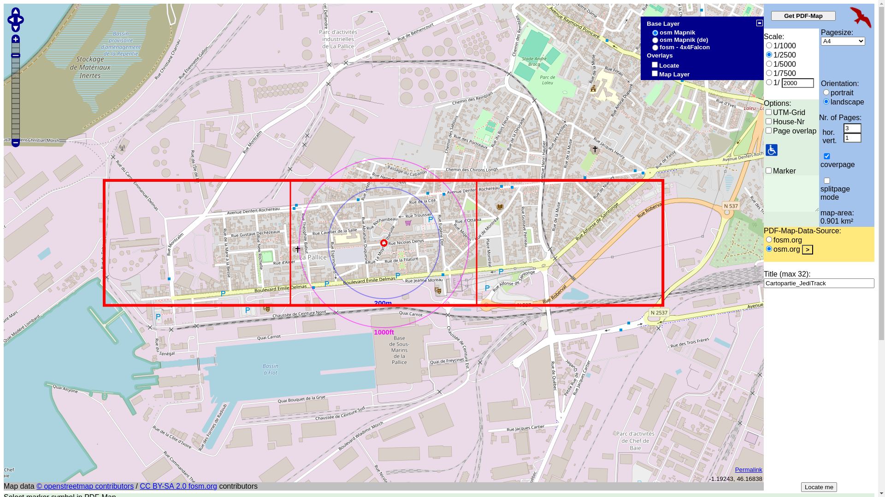

# Mini-projet #4 - Organiser une cartopartie intergénérationnelle

> **À la recherche d'une activité qui rassemble les générations autour d'un projet concret, d'un moyen de sensibiliser aux enjeux locaux ou d'une animation qui favorise la citoyenneté active, cette fiche accompagne les animateurs et éducateurs dans l'organisation de cartoparties intergénérationnelles avec une méthodologie éprouvée, des outils pratiques et des conseils pour créer du lien social durable.**

Une **cartopartie** est un projet collaboratif de cartographie, où les participants se rendent sur le terrain pour relever des informations géographiques. Elle permet d'aborder des **problématiques locales** qui touchent directement le quotidien des habitants (accessibilité, environnement, infrastructures), tout en favorisant des échanges entre tous les membres de la communauté. Cette activité rassemble des citoyens de tous âges et horizons, chacun apportant sa perspective unique : les résidents de longue date partagent leur connaissance approfondie du territoire, tandis que les nouveaux arrivants et les jeunes apportent un regard neuf et des compétences variées pour la collecte et l'organisation des données.

Ce moment collectif encourage la **citoyenneté active**, en sensibilisant l'ensemble des participants aux enjeux de leur quartier et à l'importance de l'amélioration de leur environnement commun. La diversité des participants enrichit les échanges et permet une compréhension plus globale des besoins de la communauté, favorisant ainsi des solutions plus inclusives et représentatives de tous les habitants. Les objectifs d’une cartopartie intergénérationnelle sont variés : 

1. **Renforcer le lien social** en permettant aux citoyens de collaborer sur un projet concret et utile.
2. **Sensibiliser aux problématiques locales**, comme l'accessibilité et la qualité de vie dans l'espace public.
3. **Encourager l’observation et l’esprit critique** sur les aménagements urbains et leur impact sur la communauté.
4. **Créer du sens autour d’une action collective**, en impliquant chaque participant dans l'amélioration de son environnement.
5. **Initier à la cartographie** en familiarisant les participants avec les concepts de base de la représentation spatiale et de la collecte de données géographiques.

> 🧙
> ### **Pourquoi ça marche si bien en animation ?**
> Parce que les participants ne subissent pas une présentation sur leur quartier, ils *l'explorent* activement. Ils observent, échangent leurs points de vue, découvrent des aspects méconnus de leur environnement... Et pendant qu'ils cartographient ensemble, ils créent naturellement du lien social, développent leur regard critique et renforcent leur sentiment d'appartenance à la communauté.
> La cartopartie présente l'avantage unique de transformer chaque participant en expert de son environnement. Les seniors apportent leur mémoire collective et leur connaissance historique des lieux, tandis que les plus jeunes contribuent avec leur capacité d'observation fine et leurs compétences organisationnelles. Cette **complémentarité générationnelle** enrichit considérablement la qualité des données collectées et crée des moments d'apprentissage mutuel particulièrement valorisants. De plus, contrairement à de nombreuses activités participatives, la cartopartie **produit des résultats concrets et durables qui bénéficient directement à la communauté locale**, renforçant ainsi le sentiment d'utilité et d'engagement des participants.

# Que trouverez-vous dans cette fiche ?

| **🎯 Une méthodologie pour la préparation méthodique de votre cartopartie** - Préparation en amont - 4 étapes essentielles : choisir un thème pertinent, définir la zone à cartographier, préparer des cartes lisibles et rassembler le matériel nécessaire | [Accéder à la section](https://www.notion.so/Mini-projet-4-Organiser-une-cartopartie-interg-n-rationnelle-184e0fff8c6780e19aead21db7f55460?pvs=21) |
| --- | --- |
| **🗺️ Des conseils pour la conduite de l’activité** - Déroulé de la cartopartie - 3 phases clés : poser les bases de l'activité, collecter des données sur le quartier et échanger sur les observations | [Accéder à la section](https://www.notion.so/Mini-projet-4-Organiser-une-cartopartie-interg-n-rationnelle-184e0fff8c6780e19aead21db7f55460?pvs=21) |
| **🌱 Une stratégie de continuité après l'événement** - Activités de continuation et valorisation - Contribuer à OpenStreetMap et rendre les données visibles localement pour créer un impact durable | [Accéder à la section](https://www.notion.so/Mini-projet-4-Organiser-une-cartopartie-interg-n-rationnelle-184e0fff8c6780e19aead21db7f55460?pvs=21) |
| **✅ Une organisation pratique de vos séances** - Notre checklist pour les animateurs - Avant, pendant et après l'atelier pour ne rien oublier | [Accéder à la section](https://www.notion.so/Mini-projet-4-Organiser-une-cartopartie-interg-n-rationnelle-184e0fff8c6780e19aead21db7f55460?pvs=21) |
| **💡 Un accompagnement basé sur l'expérience** - Nos derniers conseils - 5 recommandations pratiques pour réussir votre cartopartie intergénérationnelle | [Accéder à la section](https://www.notion.so/Mini-projet-4-Organiser-une-cartopartie-interg-n-rationnelle-184e0fff8c6780e19aead21db7f55460?pvs=21) |

# Préparation en amont

### **💡 Choisir un thème 👉 Quel thématique touche notre public cible de manière pertinente et engageante ?**

Sélectionner un thème approprié est la première étape cruciale pour organiser une cartopartie. Il est impossible — et peu judicieux — de tout cartographier dans une zone donnée. Non seulement cela serait excessivement complexe en termes d'observation, mais aussi peu pertinent pour l'analyse. Le thème choisi doit être précis, concret et directement lié aux préoccupations locales des participants. Cette approche donne du sens à l'activité et encourage l'implication de chacun. Le thème doit refléter les enjeux spécifiques du quartier ou de la communauté, tout en permettant d'identifier facilement des points d'intérêt sur la zone sélectionnée. Optez pour un sujet que tous les participants peuvent comprendre, s'approprier et observer aisément. Privilégiez des thèmes où les observations peuvent déboucher sur des améliorations concrètes. Enfin, assurez-vous que le thème puisse susciter l'intérêt des participants de tous âges.

Pour vous aider dans l’exploration du thème, vous pouvez utilisez le [vade-mecum](http://fr.wiktionary.org/wiki/vade-mecum) de l'OSMeur. Ces fiches « pense-bête » au format PDF et/ou ODT, en A5 recto-verso, en noir et blanc, servent de complément aux cartes papier, peuvent être distribuées lors des cartoparties ou emportées partout pour savoir quoi noter et comment. Vous pouvez les utiliser telles quelles ou créer votre propre version adaptée à vos besoins, en vous en servant comme source d'information et d'inspiration. Voici quelques thèmes exemplifiant la démarche : 

| **Thèmes** | **Exemples de points d'intérêt** | **Accès au vade-mecum** |
| --- | --- | --- |
| **1. Accessibilité et qualité de vie** | Rétrécissement des trottoirs, chaussées abîmées. Zones difficiles d'accès pour les PMR. Poubelles manquantes ou mal situées. Présence de bancs ou d'espaces de repos … | https://wiki.openstreetmap.org/wiki/File:Osmecum-handicap-moteur-cheminement-independant.ods |
| **2. Équipements publics et sécurité** | Localisation des passages piétons. Niveau d'éclairage dans les rues (lampadaires). Présence et état des arrêts de bus, bornes de recharge électrique. Localisation des parcs et espaces de loisirs. | https://wiki.openstreetmap.org/w/images/e/e3/OsmecumCity.pdf |
| **3. Dispositifs de santé** | Localisation des pharmacies et cabinets médicaux. Présence de défibrillateurs publics. Accessibilité des centres de santé pour les PMR. Emplacements des points d'eau potable publics … | https://wiki.openstreetmap.org/w/images/thumb/f/f6/OSMecum-santé.pdf/page1-1753px-OSMecum-santé.pdf.jpg
https://wiki.openstreetmap.org/w/images/thumb/f/f6/OSMecum-santé.pdf/page2-1753px-OSMecum-santé.pdf.jpg |
| **4. Mobilité douce et infrastructures pour cyclistes** | Pistes cyclables présentes ou absentes. Parkings à vélos sécurisés. Zones dangereuses pour les cyclistes ou piétons. Bornes de recharge pour vélos électriques … | https://wiki.openstreetmap.org/w/images/1/11/OSMecum_CartoVeloIDF_facile_A4.pdf
https://wiki.openstreetmap.org/w/images/6/62/OSMecum_CartoVeloIDF_moyen_A4.pdf
https://wiki.openstreetmap.org/w/images/4/4d/OSMecum_CartoVeloIDF_avancé_A4.pdf |

---

### 📍 **Définir la zone à cartographier 👉 Où commence et où s’arrete notre cartographie ?**

La zone doit être directement liée au thème choisi et facilement accessible pour tous les participants. Elle doit être suffisamment vaste pour offrir des observations variées, mais pas trop étendue pour être couverte dans le temps imparti. Vous pouvez diviser la zone en groupes. Un groupe de 6 cartographes constitue une bonne limite. En effet, 3 rôles principaux (responsable de la carte, de la relève et de la photographie) seront distribués au sein du groupe, permettant d'avoir un responsable et un suppléant pour chaque rôle. Divisez votre zone en autant de groupes que nécessaire pour que l'ensemble de vos participants ait un rôle. Privilégiez une zone que la majorité des participants connaissent bien, ce qui facilitera les échanges et les observations. Assurez-vous que la zone choisie présente des éléments intéressants à observer en lien avec votre thème. Votre zone de cartopartie doit répondre aux critères suivants :

- [ ]  Être accessible à tous les participants, y compris les personnes à mobilité réduite
- [ ]  Offrir une diversité d'éléments à observer en lien avec le thème choisi
- [ ]  Être suffisamment familière pour la majorité des participants
- [ ]  Pouvoir être parcourue dans le temps imparti pour l'activité
- [ ]  Présenter des enjeux locaux pertinents pour la communauté

---

### 🗺️ **Préparer les cartes 👉 Comment faciliter le travail de relève grâce à des cartes lisibles ?**

Une fois la zone définie et la répartition par groupe effectuée, la création des dossiers de relève, en particulier des **cartes**, constitue l'étape suivante. Cette phase exige du temps, de la préparation et de la rigueur. Des cartes claires et faciles à lire permettent aux participants de localiser précisément les points d'intérêt sur le terrain et de les noter efficacement. La lisibilité des cartes réduit les erreurs de localisation et garantit une collecte de données plus fiable. Elle encourage tous les participants, quel que soit leur niveau d'expertise en cartographie, à s'impliquer activement dans l'activité. Grâce à des cartes bien conçues, les participants peuvent se concentrer sur l'observation et la collecte de données plutôt que sur l'orientation. En outre, des cartes adaptées à l'annotation sur le terrain permettent aux participants de consigner rapidement et efficacement leurs observations.

OpenStreetMap offre de nombreuses possibilités pour créer des cartes papier de haute résolution,. Vous pouvez trouver sur le wiki (https://wiki.openstreetmap.org/wiki/OSM_on_Paper) un comparatif des outils qui existent et vous permettent **d’imprimer des fonds de carte, et parfois (fonctionnalité recommandée) de diviser une zone en plusieurs cartes en format A3, A4, A5 …** 

Voici les critères essentiels pour vos cartes de cartopartie :

- [ ]  Être à une échelle appropriée pour le thème choisi
- [ ]  Couvrir la zone sélectionnée de manière complète
- [ ]  Être facilement lisibles et annotables sur le terrain
- [ ]  Permettre une orientation facile pour les participants
- [ ]  Être divisées en plusieurs fiches si nécessaire pour une meilleure visibilité

> 🧙
> ### **Notre choix : Milvusmap**
> [http://milvusmap.eu/](http://milvusmap.eu/)
> Milvusmap est un outil en ligne gratuit qui permet de créer des cartes personnalisées à partir des données OpenStreetMap. Il offre une interface simple et intuitive pour générer des cartes au format PDF, idéales pour les cartoparties et autres activités de cartographie sur le terrain.
> Il offre des données de terrain en haute résolution et permet de générer des cartes multi-pages dans divers formats, allant du A5 au A3. Les utilisateurs peuvent choisir parmi une gamme d'échelles standard, de 1:50000 à 1:1000. Cet outil gratuit ne nécessite pas d'inscription et bénéficie de mises à jour régulières des données OpenStreetMap. Les cartes sont exportées au format PDF, ce qui facilite leur impression et leur utilisation lors des cartoparties.
> Les avantages principaux de l’outil qui nous ont poussé à le choisir sont : 
> - Sa facilité d’utilisation : il n’y a pas besoin de compte ou de compréhension particulière, les éléments à paramétrer sont minimes.
> - La possibilité de changer l'échelle : le ratio d’échelle est assez large, ce qui permet d’avoir des cartes cohérentes par rapport aux besoins d’annotation.
> - La possibilité de diviser la carte sur plusieurs pages : cet option est un incontournable pour l’organisation d’une cartopartie, car cela permet de mieux gérer l’annotation. En complément, Milvusmap permet également de créer une zone de chevauchement entre les différentes pages, ce qui facilite l’orientation des cartographes en herbe.
> - La colorisation et les informations présents par défaut sur les cartes sont limités et facile à lire, ce qui aide à la fois à l’orientation et à l’annotation.
> - La présence d’une page de garde : le logiciel propose d’intégrer une page de garde pour les zones découpés en plusieurs pages. Cela permet d’avoir une page présentant la totalité de la zone et la manière dont les différentes pages sont organisées. Cela facilite l’orientation des participants.
> 

---

### 🧰 **Préparer le matériel 👉 Comment s'équiper efficacement pour une cartopartie réussie ?**

La préparation du matériel est une étape cruciale pour garantir le bon déroulement de votre cartopartie. Un équipement bien pensé facilitera le travail des participants sur le terrain et assurera la collecte efficace des données. Commencez par imprimer les **cartes détaillées** de la zone à cartographier, qui serviront de base pour les annotations. Prévoyez des **stylos** et des **crayons** pour noter les observations, ainsi que des **surligneurs** pour marquer les rues déjà parcourues. Cette technique simple permet de différencier facilement les zones cartographiées de celles restant à explorer, évitant ainsi les doublons ou les oublis.

Équipez chaque groupe de **porte-blocs** pour faciliter la prise de notes en mouvement (un pour les cartes, un pour les fiches de relève), et **d'appareils photo** ou de **smartphones** pour documenter visuellement les points d'intérêt. Préparez à l'avance des **fiches de relève** adaptées à votre thème spécifique, incluant les champs nécessaires pour une collecte de données structurée. N'oubliez pas d'inclure une **fiche d'aide** résumant les éléments clés à observer et noter, inspirée des vade-mecum mentionnés précédemment. Cette fiche servira de guide rapide sur le terrain, assurant une cohérence dans les relevés entre les différents groupes.

> 🧙
> **Exemple de fiche de relève** : https://www.canva.com/design/DAGRNiK1P74/UvSCusJWdBacl4hgMO7COQ/view?utm_content=DAGRNiK1P74&utm_campaign=designshare&utm_medium=link&utm_source=publishsharelink&mode=preview
> **Exemple de vade-mecum appliquée à l’accessibilité** : https://www.canva.com/design/DAGRNj_0XM4/OhWXPX7idiO4h4ZQu7YUcA/view?utm_content=DAGRNj_0XM4&utm_campaign=designshare&utm_medium=link&utm_source=publishsharelink&mode=preview

Enfin, pour garantir la sécurité de tous les participants, en particulier dans les zones à forte circulation, **fournissez des gilets de sécurité à chaque groupe**. Ce matériel de base, bien que simple, est essentiel pour une cartopartie réussie, permettant aux participants de se concentrer pleinement sur l'observation et la collecte de données sans se soucier de l'organisation logistique.

N'oubliez pas de prévoir un **téléphone pour l'encadrant** afin de faciliter la communication entre les groupes et la coordination de l'activité. Une préparation minutieuse du matériel contribuera grandement au succès de votre cartopartie en permettant aux participants de se concentrer pleinement sur l'observation et la collecte de données.

# Déroulé de la cartopartie

Une fois que tous les préparatifs sont terminés, la date fixée et les participants rassemblés, voici les grandes étapes du déroulé de votre journée de cartopartie. Attention à garder du temps pour introduire les différents éléments logistiques, expliquer comment utiliser les cartes et rassembler les groupes.

---

### **🎬 Poser les bases de l'activité 👉 Comment introduire et expliquer la cartopartie ?**

Commencez par une présentation claire du thème choisi et de son importance pour la communauté. Expliquez les rôles au sein de chaque groupe et détaillez l'utilisation des cartes et des fiches de relevé. Cette étape est cruciale pour sensibiliser les participants et les motiver à s'impliquer activement dans le projet. Assurez-vous que tous comprennent bien les objectifs et le déroulement de l'activité. Donnez leur également des conseils sur l’utilisation du matériel, la manière de faire le relevé, l’utilisation des surligneurs … 

Répartissez les participants dans leurs groupes, distribuez-leur les cartes, et laissez-leur du temps pour découvrir le matériel. Une fois fait, demandez-leur d'identifier avant de partir qui sera en charge de quoi (un responsable et un suppléant) : 

- Un **cartographe** qui localise les points d'intérêt sur la carte
- Un **responsable des relevés** qui note les détails observés
- Un **photographe** qui documente visuellement les observations

---

### **🚶‍♀️ Collecter des données sur le quartier 👉 Comment explorer le terrain efficacement ?**

Une fois l'ensemble des consignes données et les groupes formés, laissez-les partir librement en exploration à la découverte du quartier choisi pour relever les points d'intérêt liés au thème. Ils notent les lieux importants sur la carte, remplissent les fiches de relevé et prennent des photos. Prévoyez un animateur « volant » : c'est une bonne pratique pour s'assurer que tous les groupes travaillent au même rythme et que personne n'a de problèmes de compréhension de l'activité. Cet animateur volant peut communiquer directement avec les groupes — pensez à collecter un numéro de téléphone d'un référent par groupe — et il est préférable qu'il ou elle soit véhiculé(e) afin de pouvoir naviguer facilement entre les groupes. Prévoyez un point de ralliement commun — il peut être judicieux de penser à cet aspect au moment de la découpe des zones de cartographie — et, si besoin, le rapatriement des groupes se trouvant aux extrémités de la zone.

---

### **🗣️ Échanger sur les observations 👉 Comment restituer et partager les découvertes ?**

Une fois de retour au point de ralliement, chaque groupe a l'opportunité de présenter ses découvertes aux autres participants. Animez une discussion collective dynamique sur les observations recueillies, en encourageant tous les membres à partager leurs perspectives. Cette étape peut permettre d’identifier collectivement les points d'amélioration du quartier et pour stimuler la réflexion sur des actions concrètes à entreprendre.

Pour rendre ce moment de partage enrichissant et convivial, vous pouvez organisez une activité sociale en parallèle. Par exemple, vous pourriez prévoir un repas partagé où chacun apporte un plat, organiser un pique-nique dans un parc local, ou même arranger une visite guidée en lien avec la thématique de la cartopartie. Ces moments informels renforcent les liens entre les participants de différentes générations, favorisent des échanges plus personnels, et créent une atmosphère propice à la continuation du dialogue au-delà de l'activité elle-même.

N'oubliez pas de prévoir suffisamment de temps pour cette phase de restitution et d'échange.

# Activités de continuation et valorisation

Une fois la cartopartie terminée, il est important de ne pas laisser retomber l'enthousiasme et l'engagement des participants. Les activités de continuation permettent de valoriser le travail accompli, d'approfondir les connaissances acquises et de transformer les observations en actions concrètes. 

---

💻 **Contribuer à OpenStreetMap 👉 Comment s’impliquer dans une communauté plus large ?**

Dans les jours qui suivent, organisez une session pour transférer les informations collectées sur OpenStreetMap. C'est l'occasion idéale d'initier les participants à la contribution en ligne, en leur montrant comment leurs observations locales peuvent avoir un impact global. Cette étape peut être réalisée en groupe ou individuellement, selon les compétences numériques de chacun, permettant ainsi de valoriser les différentes aptitudes des participants. 

**OpenStreetMap (OSM)** est un projet de cartographie collaborative et libre, où des contributeurs du monde entier ajoutent, modifient et mettent à jour des informations géographiques. Créée en 2004, cette carte est souvent qualifiée de "Wikipedia de la cartographie", car tout le monde peut y participer, que ce soit en ajoutant des routes, des bâtiments, ou des points d'intérêt comme des écoles, des hôpitaux, ou des parcs.

OSM est aujourd'hui l'une des cartes les plus complètes et les plus flexibles du monde, utilisée pour des projets aussi variés que la gestion de crises humanitaires, l'organisation d'événements ou encore la création d'applications géographiques. La **communauté OSM**, composée de milliers de bénévoles, s'engage dans des projets locaux et internationaux, allant de la cartographie des zones touchées par des catastrophes naturelles à l’amélioration des cartes locales pour des raisons de mobilité, d’accessibilité, ou de développement urbain.

[https://www.youtube.com/watch?v=QPz9p8VjS5U&pp=ygUNb3BlbnN0cmVldG1hcA==](https://www.youtube.com/watch?v=QPz9p8VjS5U&pp=ygUNb3BlbnN0cmVldG1hcA==)

---

📍 **Rendre les données visibles localement 👉 Comment valoriser cette action auprès de la communauté ?** 

Pour valoriser l'action auprès de la communauté locale, plusieurs options s'offrent à vous. Vous pouvez organiser une **exposition temporaire** dans un lieu public (mairie, bibliothèque, centre communautaire) présentant les cartes annotées, les photos et les observations recueillies. La publication d'un **article dans le journal local** ou l'organisation d'une **présentation publique** en présence des élus et des habitants intéressés sont d'excellents moyens de partager les résultats. La création d'une **brochure ou d'un mini-guide** compilant les informations collectées peut être distribuée gratuitement. Enfin, l'utilisation des **réseaux sociaux** de la ville ou de l'association organisatrice permet de diffuser régulièrement les découvertes. Ces actions sensibiliseront un large public aux enjeux identifiés et valoriseront le travail collectif des participants.https://www.youtube.com/watch?v=QPz9p8VjS5U&pp=ygUNb3BlbnN0cmVldG1hcA==

Vous pouvez également créé **votre propore carte interactive et ouverte en ligne, dédiée à votre action**. En particulier, si vous n’êtes pas à l’aise avec l’interface OpenStreetMap, d’autres logiciels vous permettront de réaliser une carte en ligne, ouverte, accessible et collaborative, simplement. 

> 🧙
> ### Notre conseil - Utilisation de uMap
> uMap est un outil en ligne gratuit et open source qui permet de créer facilement des cartes personnalisées basées sur OpenStreetMap. uMap offre une interface intuitive, ne nécessitant aucune compétence technique avancée. Vous pouvez créer une carte en quelques clics et commencer à ajouter des points d'intérêt immédiatement. L'outil permet d'ajouter des marqueurs, des lignes, des polygones, et même d'importer des données depuis des fichiers CSV ou GPX. Vous pouvez personnaliser les icônes, les couleurs, et les styles pour chaque élément de votre carte.
> uMap permet de créer plusieurs couches (ou calques) sur une même carte. Cette fonctionnalité est particulièrement utile pour organiser différentes cartoparties thématiques sur une seule carte interactive. En utilisant uMap pour vos cartoparties, vous pouvez créer une carte centrale pour votre communauté où chaque nouvelle cartopartie ajoute une couche supplémentaire. Cette approche permet de visualiser les différents thèmes explorés au fil du temps (accessibilité, patrimoine, environnement, etc.) et de créer une véritable émulation autour de la pratique de la cartographie participative. Les participants peuvent voir l'évolution de leur contribution dans un contexte plus large, ce qui renforce leur engagement et l'impact de chaque cartopartie.
> Les cartes créées sur uMap peuvent être facilement partagées via un lien URL ou intégrées dans un site web. Vous pouvez également permettre à d'autres utilisateurs de contribuer à votre carte, favorisant ainsi la collaboration. Étant basé sur OpenStreetMap et utilisant des formats ouverts, uMap garantit que vos données restent accessibles et réutilisables dans d'autres contextes.
> [https://www.youtube.com/watch?v=-gR4IN1meOY&pp=ygUEdW1hcA==](https://www.youtube.com/watch?v=-gR4IN1meOY&pp=ygUEdW1hcA==)

Ces idées sont des inspirations, concevez votre plan de continuation et de valorisation selon les besoins de votre groupe et votre contexte local. Cela renforcera le sentiment d'utilité et d'engagement des participants.

> 🧙
> # Notre checklist pour les animateurs
> ### Avant l'atelier
> - [ ]  **Choisir un thème** pertinent pour les participants et adapté à la zone cartographiée.
> - [ ]  **Sélectionner la zone à cartographier** et vérifier qu’elle est accessible à tous les participants (personnes âgées, PMR).
> - [ ]  **Imprimer les cartes papier** nécessaires et prévoir des fiches de relevé pour chaque groupe.
> - [ ]  **Répartir les rôles** au sein de chaque groupe (cartographe, photographe, personne en charge des relevés).
> - [ ]  **Préparer le matériel** : stylos, fiches de relevé, appareils photo, cartes.
> ### Pendant l'atelier
> - [ ]  **Animer une introduction** claire sur le thème et les objectifs de l’activité.
> - [ ]  **Encourager les échanges** entre jeunes et seniors pendant les relevés de terrain.
> - [ ]  **Veiller à la sécurité** pendant la sortie (notamment si le groupe se déplace sur des routes ou des trottoirs).
> - [ ]  **Encourager la prise de photos** pour documenter chaque point d’intérêt.
> - [ ]  **Superviser les groupes** pour s'assurer que chacun remplit bien ses fiches et localise les points d’intérêt sur la carte.
> ### Après l'atelier
> - [ ]  **Encourager les groupes à partager** leurs observations lors de la restitution.
> - [ ]  **Discuter des actions possibles** pour améliorer les problématiques relevées.
> - [ ]  **Valoriser les contributions** de chaque participant, en soulignant l’importance de leurs observations pour la communauté.

# Nos derniers conseils

1. **Simplifiez les objectifs :** Ne cherchez pas à tout cartographier. Concentrez-vous sur un ou deux thèmes précis pour permettre à tous les participants de s’impliquer pleinement et de comprendre l’importance de leurs contributions.
2. **Créez un climat d'échange :** Favorisez les discussions entre jeunes et seniors pour que chacun apporte sa vision du quartier. Les seniors peuvent partager leurs souvenirs et leur expérience, tandis que les jeunes contribuent avec des compétences organisationnelles et technologiques.
3. **Adaptez le parcours :** Prévoyez des trajets courts et accessibles, notamment si des personnes âgées ou à mobilité réduite participent à la cartopartie. Pensez également à prévoir des pauses si nécessaire.
4. **Utilisez des outils simples :** Pas besoin d’outils numériques complexes. Les cartes papier, les stylos et les photos suffisent amplement pour documenter l’activité.
5. **Mettez en valeur le travail collectif** : Organisez une restitution en fin d’atelier pour que chaque groupe puisse présenter ses relevés et discuter de l’impact des observations sur le quartier.

La cartopartie intergénérationnelle est un excellent moyen de **renforcer les liens sociaux** tout en contribuant à l’amélioration du quartier. Ce projet encourage les participants à **observer leur environnement**, à **discuter des enjeux locaux** et à **proposer des solutions concrètes**. L’essentiel est de créer un moment collectif où chacun, peu importe son âge, peut apporter sa contribution et se sentir acteur de la communauté.

**Bonne cartopartie à tous !**
