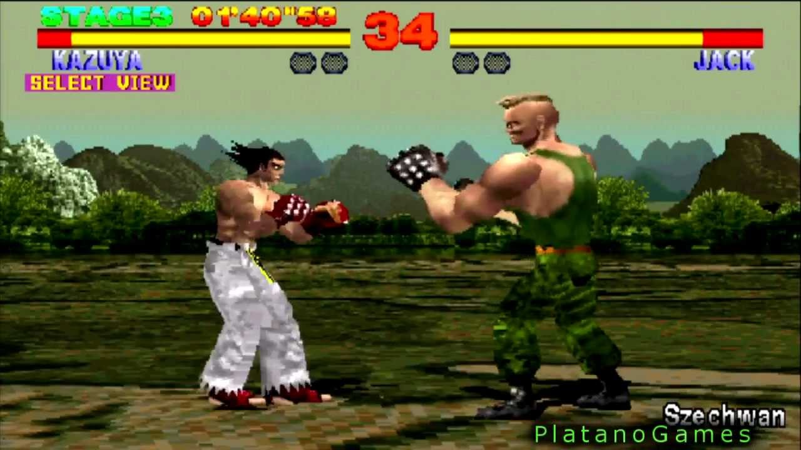

# Tekken

Concepteur: https://fr.wikipedia.org/wiki/Seiichi_Ishii
Description: Cette série de jeux de combat, qui a débuté en 1994, est célèbre pour son gameplay complexe et ses graphismes impressionnants. Elle est toujours populaire aujourd'hui, avec de nombreuses suites et spin-offs.
Développeur: Namco
Sortie arcade: 9 décembre 1994

