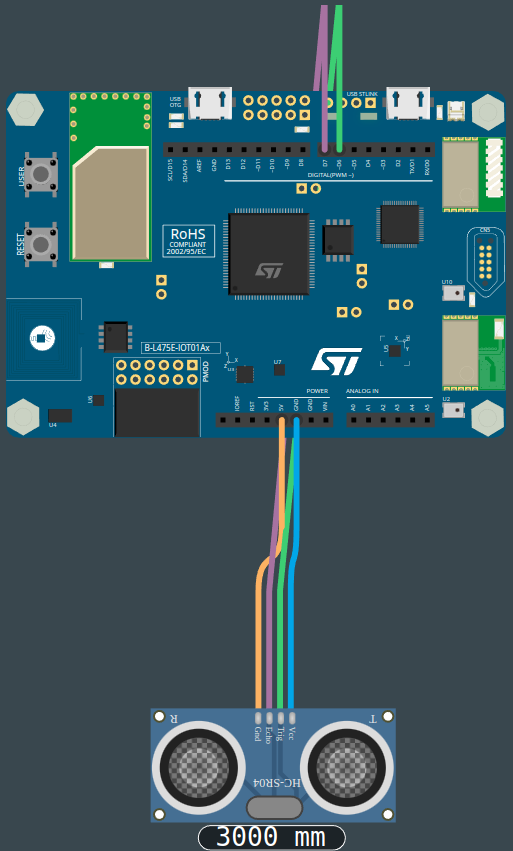

# PROG12-TDL-1

Nom de la fiche: Mesurer une durée
Id protocole: PR12-TDL
Nom du protocole: Le son se déplace-t-il de plus de 100 mètres en 1 seconde ? (https://www.notion.so/Le-son-se-d-place-t-il-de-plus-de-100-m-tres-en-1-seconde-ea4606d1769a4667a0917b93f49526cc?pvs=21)
Lié à Protocoles d’expérimentation (1) (Fiches programmation): Sans titre (https://www.notion.so/3ed71c5591f44047804dd7dcd3d2dc83?pvs=21)

🛠️**Construire**

**Câbler le capteur de distance**

Le capteur de distance nommé **HC-SR04** possède quatre broches nommées **GND**, **VCC**, **Trig** et **Echo**.

Vous allez devoir connecter les broches du capteur de la manière suivante :

- La broche **GND** du capteur sur la broche **GND** de la carte
- La broche **VCC** du capteur sur la broche **5V** de la carte
- La broche **Trig** du capteur sur la broche **D6** de la carte
- La broche **Echo** du capteur sur la broche **D7** de la carte

**Connecter la carte à l'ordinateur**

Avec votre câble USB, connectez la carte à votre ordinateur en utilisant le connecteur micro-USB ST-LINK (sur le coin en haut à droite de la carte). Si tout se passe bien, vous devriez voir apparaître sur votre ordinateur un nouveau lecteur appelé DIS_L4IOT. Ce lecteur est utilisé pour programmer la carte en copiant simplement un fichier binaire.



**Ouvrir MakeCode**

Allez dans l'éditeur MakeCode de Let's STEAM. Sur la page d'accueil, créez un nouveau projet en cliquant sur le bouton "Nouveau projet". Donnez à votre projet un nom plus expressif que "Sans titre" et lancez votre éditeur. *Ressource : [makecode.lets-steam.eu](http://makecode.lets-steam.eu/)*

**Installer les extensions hcsr04 et serial**

Après avoir créé votre nouveau projet, vous obtiendrez l'écran par défaut "prêt à l'emploi" et vous devrez installer deux extensions.

<aside>
ℹ️ **Les extensions dans MakeCode sont des groupes de blocs de code qui ne sont pas directement inclus dans les blocs de code de base que l'on trouve dans MakeCode. Les extensions, comme leur nom l'indique, ajoutent des blocs pour des fonctionnalités spécifiques. Il existe des extensions pour un large éventail de fonctionnalités très utiles, ajoutant des capacités de manette de jeu, de clavier, de souris, de servomoteurs, de la robotique et bien plus encore.**

</aside>

Vous voyez le bouton noir **AVANCÉ** en bas de la colonne des différents groupes de blocs. Si vous cliquez sur **AVANCÉ**, vous verrez apparaître des groupes de blocs supplémentaires. En bas, il y a une boîte grise appelée **EXTENSIONS**. Cliquez sur ce bouton.

Dans la liste des extensions disponibles, vous pouvez facilement trouver les extensions **hcsr04** et **serial** qui seront utilisées pour cette activité. L’extension hcsr04 ****vous permettra d’interagir avec le capteur de distance, tandis que l’extension serial vous permettra de collecter les données de temps de réaction et de les afficher dans la console. Si les extensions ne sont pas directement disponibles sur votre écran, vous pouvez les rechercher à l'aide de l'outil de recherche. Cliquez sur l’extension que vous souhaitez utiliser et un nouveau groupe de blocs apparaîtra sur l'écran principal.

**Programmer la carte**

Dans l'éditeur JavaScript de MakeCode, copiez/collez le code disponible dans la section "Programmer" ci-dessous. Si ce n'est pas déjà fait, pensez à donner un nom à votre projet et cliquez sur le bouton "Télécharger". Copiez le fichier binaire sur le lecteur DIS_L4IOT et attendez que la carte finisse de clignoter.

**Exécuter, modifier, jouer**

Votre programme s'exécutera automatiquement chaque fois que vous le sauvegarderez ou que vous réinitialiserez votre carte (appuyez sur le bouton intitulé RESET). Pour observer la distance mesurée par le capteur ouvrez la console (bouton disponible en dessous du simulateur). Lorsque vous appuierez sur le bouton USER (bouton bleu sur la carte), le capteur enverra une onde ultrasonique et il s’affichera sur la console le temps en microsecondes qu’a mis l’onde à faire l’aller-retour entre le capteur et l’obstacle.

**🧑‍💻 Programmer**

```jsx
Serial.attachToConsole()
input.buttonUser.onEvent(ButtonEvent.Click, function () {
    Serial.writeValue("travel time", HCSR04.getTime(MHCSR04TimeUnit.Us))
})
```