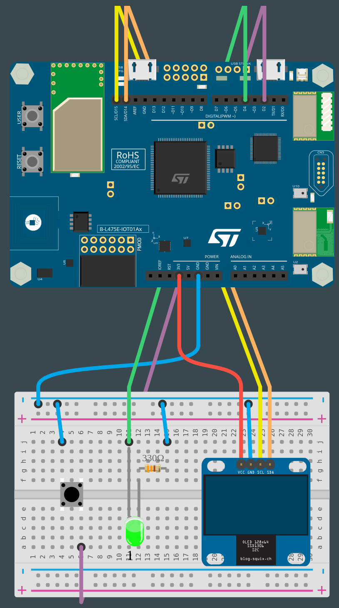

# PROG13-TDL-3

Nom de la fiche: Afficher les données collectées sur un écran
Id protocole: PR13-TDL
Nom du protocole: Votre temps de réaction est-il inférieur à une demi-seconde ? (https://www.notion.so/Votre-temps-de-r-action-est-il-inf-rieur-une-demi-seconde-f8b85cfb3d854ffd9831ef8ae334a11b?pvs=21)
Lié à Protocoles d’expérimentation (1) (Fiches programmation): Sans titre (https://www.notion.so/ff829bc7ef224b46bcfba83a061644aa?pvs=21)

🛠**Construire**

**Réaliser les câblages**

Pour démarrer cette étape, vous devez avoir réalisé les fiches 1 ou/et 2 afin d’avoir votre LED, votre buzzer et votre bouton-poussoir prêt à l’emploi. Reprenez les branchements afin de préparer votre circuit initial et pensez à installer les extensions, notamment Music, pour pouvoir utiliser correctement le buzzer.

**Connecter l'écran**

Il y a deux façons de câbler l'écran OLED SSD1306 à une carte, soit avec une connexion I2C ou SPI. Pour notre écran, nous utilisons la connexion I2C :

- Bleu pour GND
- Rouge pour V+ (3V3)
- Orange pour SDA (D14)
- Jaune pour SCL (D15)

*Ressources : [https://en.wikipedia.org/wiki/I2C](https://en.wikipedia.org/wiki/I2C), [https://en.wikipedia.org/wiki/Serial_Peripheral_Interface](https://en.wikipedia.org/wiki/Serial_Peripheral_Interface), [https://www.sparkfun.com/qwiic](https://www.sparkfun.com/qwiic), [https://learn.adafruit.com/introducing-adafruit-stemmaqt/what-is-stemma-qt](https://learn.adafruit.com/introducing-adafruit-stemmaqt/what-is-stemma-qt)*



**Connecter la carte à l'ordinateur**

Avec votre câble USB, connectez la carte à votre ordinateur en utilisant le connecteur micro-USB ST-LINK (sur le coin en haut à droite de la carte). Si tout se passe bien, vous devriez voir apparaître sur votre ordinateur un nouveau lecteur appelé DIS_L4IOT. Ce lecteur est utilisé pour programmer la carte en copiant simplement un fichier binaire.

**Ouvrir MakeCode**

Allez dans l'éditeur MakeCode de Let's STEAM. Sur la page d'accueil, créez un nouveau projet en cliquant sur le bouton "Nouveau projet". Donnez à votre projet un nom plus expressif que "Sans titre" et lancez votre éditeur. *Ressource : [makecode.lets-steam.eu](http://makecode.lets-steam.eu/)*

**Ajouter une extension**

Pour utiliser cet écran, il est nécessaire d’installer l’extension nommée “**oled**”. Pour l’installer, cliquez sur l’icône en forme d’engrenage en haut à gauche de MakeCode, puis sélectionnez “Extensions”. Une nouvelle fenêtre s’ouvre dans laquelle vous choisissez l’extension dont vous avez besoin en cliquant dessus, si vous ne la trouvez pas, vous pouvez utiliser la barre de recherche en haut de l’écran.

**Programmer la carte**

Dans l'éditeur JavaScript de MakeCode, copiez/collez le code disponible dans la section "Programmer" ci-dessous. Si ce n'est pas déjà fait, pensez à donner un nom à votre projet et cliquez sur le bouton "Télécharger". Copiez le fichier binaire sur le lecteur DIS_L4IOT et attendez que la carte finisse de clignoter.

**Exécuter, modifier, jouer**

Votre programme s'exécutera automatiquement chaque fois que vous le sauvegarderez ou que vous réinitialiserez votre carte (appuyez sur le bouton intitulé RESET).

**🧑‍💻 Programmer**

***Avec un stimulus visuel - LED***

```jsx
function newGame () {
    pins.D4.digitalWrite(false)
    pause(randint(1000, 5000))
    timeTurnOn = control.millis()
    pins.D4.digitalWrite(true)
}
input.buttonD2.onEvent(ButtonEvent.Down, function () {
    reaction = control.millis() - timeTurnOn
    oled.clear()
    oled.showString("Reaction time:", 1)
    oled.showString("" + reaction + "ms", 2)
    newGame()
})
let reaction = 0
let timeTurnOn = 0
Serial.attachToConsole()
newGame()
```

***Avec un stimulus sonore - Buzzer***

```jsx
function newGame () {
    music.stopAllSounds()
    pause(randint(1000, 5000))
    timeTurnOn = control.millis()
    music.ringTone(262)
}
input.buttonD2.onEvent(ButtonEvent.Down, function () {
    reaction = control.millis() - timeTurnOn
    oled.clear()
    oled.showString("Reaction time:", 1)
    oled.showString("" + reaction + "ms", 2)
    newGame()
})
let reaction = 0
let timeTurnOn = 0
Serial.attachToConsole()
newGame()
```