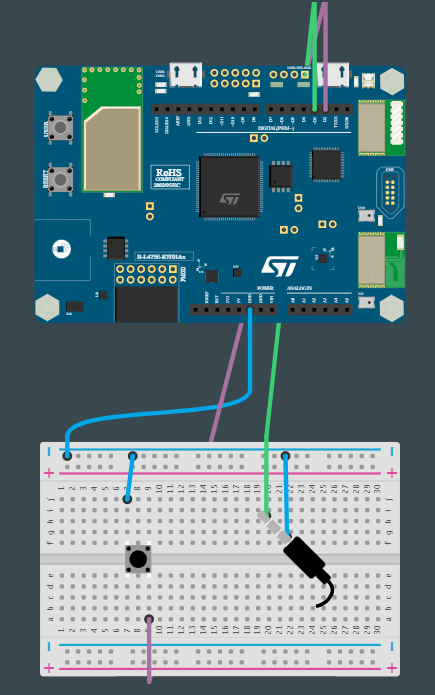

# PROG14-TDL-2

Nom de la fiche: Mesurer le temps de réaction grâce à un stimulus sonore (buzzer)
Id protocole: PR14-TDL
Nom du protocole: La distraction peut-elle modifier votre temps de réaction ? (https://www.notion.so/La-distraction-peut-elle-modifier-votre-temps-de-r-action-e2ca8b3413424c7b8c1a58cd93fc6d83?pvs=21)
Lié à Protocoles d’expérimentation (1) (Fiches programmation): Sans titre (https://www.notion.so/7421d911fb2f4020b1168ba2053214a4?pvs=21)

🛠 **Construire**

**Câbler le bouton-poussoir**

Connectez une patte du bouton à la broche **GND** de la carte. Connectez ensuite l'autre patte sur la broche **D2**. 

**Câbler le buzzer**

En théorie, un buzzer n'est pas polarisé (cela signifie qu'il n'y a pas de "+" ni de "-"), mais il y a souvent une paire de fils noir/rouge ou des signes ("+" et/ou "-") sur l'appareil. Si vous êtes dans cette configuration, attachez le fil du côté "+" du buzzer à la *pin* **D3** et l'autre à la *pin* **GND**. S'il n'y a pas de couleur ou d'indication, branchez simplement un fil sur la *pin* **D3** et l'autre sur la *pin* **GND**.

**Connecter la carte à l'ordinateur**

Avec votre câble USB, connectez la carte à votre ordinateur en utilisant le connecteur micro-USB ST-LINK (sur le coin en haut à droite de la carte). Si tout se passe bien, vous devriez voir apparaître sur votre ordinateur un nouveau lecteur appelé DIS_L4IOT. Ce lecteur est utilisé pour programmer la carte en copiant simplement un fichier binaire.



**Ouvrir MakeCode**

Allez dans l'éditeur MakeCode de Let's STEAM. Sur la page d'accueil, créez un nouveau projet en cliquant sur le bouton "Nouveau projet". Donnez à votre projet un nom plus expressif que "Sans titre" et lancez votre éditeur. *Ressource : [makecode.lets-steam.eu](http://makecode.lets-steam.eu/)*

**Installer les extensions**

Après avoir créé votre nouveau projet, vous obtiendrez l'écran par défaut "prêt à l'emploi" et vous devrez installer deux extensions.

<aside>
ℹ️ **Les extensions dans MakeCode sont des groupes de blocs de code qui ne sont pas directement inclus dans les blocs de code de base que l'on trouve dans MakeCode. Les extensions, comme leur nom l'indique, ajoutent des blocs pour des fonctionnalités spécifiques. Il existe des extensions pour un large éventail de fonctionnalités très utiles, ajoutant des capacités de manette de jeu, de clavier, de souris, de servomoteurs, de la robotique et bien plus encore.**

</aside>

Vous voyez le bouton noir **AVANCÉ** en bas de la colonne des différents groupes de blocs. Si vous cliquez sur **AVANCÉ**, vous verrez apparaître des groupes de blocs supplémentaires. En bas, il y a une boîte grise appelée **EXTENSIONS**. Cliquez sur ce bouton.

Dans la liste des extensions disponibles, vous pouvez facilement trouver les extensions **Music et Serial** qui seront utilisées pour cette activité. L’extension Music vous permettra d’émettre un son grâce au buzzer. L’extension Serial vous permettra de collecter les données de temps de réaction et de les afficher dans la console. Si elles ne sont pas directement disponibles sur votre écran, vous pouvez les rechercher à l'aide de l'outil de recherche. Cliquez sur l’extension que vous souhaitez utiliser (par exemple **Music**) et un nouveau groupe de blocs apparaîtra sur l'écran principal. Réitérez la démarche pour installer **Serial**.

**Programmer la carte**

Dans l'éditeur JavaScript de MakeCode, copiez/collez le code disponible dans la section "Programmer" ci-dessous. Si ce n'est pas déjà fait, pensez à donner un nom à votre projet et cliquez sur le bouton "Télécharger". Copiez le fichier binaire sur le lecteur DIS_L4IOT et attendez que la carte finisse de clignoter.

**Exécuter, modifier, jouer**

Votre programme s'exécutera automatiquement chaque fois que vous le sauvegarderez ou que vous réinitialiserez votre carte (appuyez sur le bouton intitulé RESET). Pour observer les différents temps de réaction collectés par le programme, ouvrez la console (bouton disponible en dessous du simulateur).


**🧑‍💻 Programmer**

```jsx
input.buttonD2.onEvent(ButtonEvent.Down, function () {
    Serial.writeValue("Reaction time (ms)", (control.millis() - timeTurnOn));
    newGame()
})
function newGame () {
    music.stopAllSounds()
    pause(randint(1000, 5000))
    timeTurnOn = control.millis()
    music.ringTone(262)
}
let timeTurnOn = 0
Serial.attachToConsole()
newGame()
```