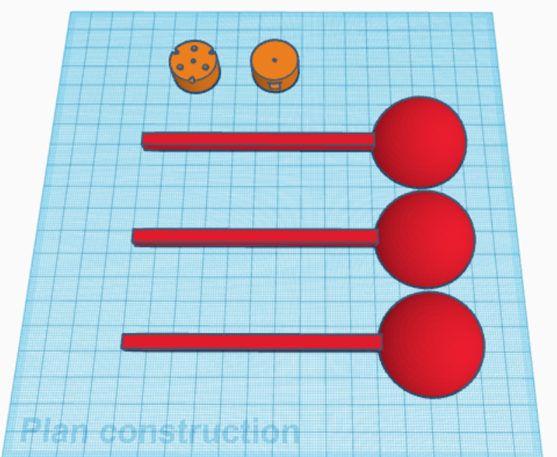
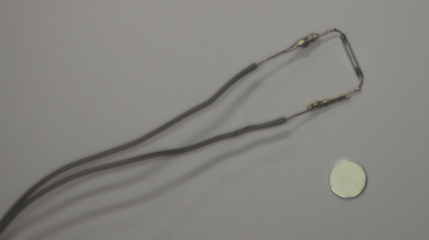

# PROG16-TDL-1

Nom de la fiche: Fabriquer un anémomètre
Id protocole: PR16-TDL
Nom du protocole: Pouvons-nous construire une solution pour accéder aux informations météorologiques ? (https://www.notion.so/Pouvons-nous-construire-une-solution-pour-acc-der-aux-informations-m-t-orologiques-b79017aece6642ef85d9a9dcc7156c5c?pvs=21)
Lié à Protocoles d’expérimentation (1) (Fiches programmation): Sans titre (https://www.notion.so/b1b7e11f392c4e51aa43756eb125c27e?pvs=21)

🛠️ **Construire**

**Construire l’anémomètre** 

Pour réaliser cette activité et mesurer la vitesse du vent à l’aide d’un anémomètre nous aurons besoin de comprendre le mouvement circulaire uniforme.

La première chose à faire est de construire un anémomètre. Nous avons choisi un anémomètre à 3 coupelles dont le principe est assez simple :

Pour optimiser l’efficacité de l’anémomètre il est important que celui-ci soit bien équilibré (pas de coupelle plus lourde que les autres et frottements les plus faibles possibles).

Pour obtenir un fichier 3D permettant d’imprimer les coupelles, il suffit de suivre ce lien : [https://www.tinkercad.com/things/2CLLBRxu49Z](https://www.tinkercad.com/things/2CLLBRxu49Z)



Nous utilisons également une tige métallique de 2 mm de diamètre pour l’axe que nous avons limée en pointe pour minimiser le contact avec la table sur laquelle elle est posée. Nous avons soudé le contact reed (qui est fragile) avec des fils d’une longueur de 30 cm environ pour avoir de la manœuvre et pris un aimant néodyme plat (10 mm de diamètre) :




Nous assemblons les coupelles avec l’articulation centrale :

En prenant 3 pics à brochettes coupés à bonne dimension (environs 10 cm), nous assemblons l’anémomètre en trépied. Nous avons également fixé l’aimant sur un des bras de l’anémomètre (à 3,5 cm du centre). Le contact reed est fixé sur un cube en bois avec du papier collant et ajusté à la bonne hauteur (maximum 5 mm de l’aimant). Une fois le montage terminé, nous fixons l’anémomètre et le cube de bois pour que le tout soit bien fixe.

Le contact reed en gros plan :


*Remarque : Ne négligez pas l’étape de montage qui est délicate mais essentielle au bon fonctionnement de l’anémomètre !!!*

Il existe plusieurs types d’anémomètres et de systèmes pour calculer la vitesse du vent. Nous avons pris le parti d’un anémomètre à coupelle que nous avons imprimé en 3d. Il est également possible de construire un anémomètre à coupelle avec des balles de Ping-Pong coupées en deux, des pics à brochette et un gobelet. Vous pouvez améliorer le système en mettant un roulement à billes (au niveau de l’articulation) pour diminuer les frottements.

- *Tutoriel anémomètre BEE-A-MAKER sur YouTube : [https://www.youtube.com/watch?v=LRwWcOVqflc](https://www.youtube.com/watch?v=LRwWcOVqflc)*
- *Autre anémomètre à imprimer en 3d : [https://www.thingiverse.com/thing:2771387/files](https://www.thingiverse.com/thing:4061735/files)*

Pour commencer, nous allons faire tourner l’anémomètre grâce au vent ou de façon manuelle et observer son comportement. Tourne-t-il à la même vitesse à l’intérieur ? A l’extérieur ? Vous pouvez souffler, pousser l’une des coupelles, ou encore courir avec l’anémomètre.

<aside>
ℹ️ Pour mesurer la période il nous faut un détecteur de passage. Nous avons choisi d’utiliser un détecteur à contact reed. Nous aurions pu également utiliser une barrière lumineuse ou autre. Un **interrupteur Reed** est un petit capteur constitué de deux lames conductrices sensibles à la présence d’un champ magnétique. À proximité d’un aimant, l’interrupteur se ferme et permet au courant électrique de passer.

En pratique, l’interrupteur est attaché à la partie fixe de l’anémomètre et reste donc immobile, alors que l’aimant est fixé sur l’une des tiges de l’anémomètre.

Pour assembler tous les éléments, nous commençons par mettre la partie mobile de l’anémomètre (rotor) sur un support stable (stator). Nous pouvons ensuite choisir une tige et y fixer un petit aimant grâce à une pastille adhésive. Enfin, pour connecter l’anémomètre, il nous faut installer le système Interrupteur Reed/Breadbord/carte programmable à proximité de l’aimant.

</aside>


**Câbler l’anémomètre**

Lorsque l’anémomètre effectue un tour, la tige portant l’aimant passe par-dessus l’interrupteur Reed alimenté par deux fils : le fil rouge (pôle positif) et le fil noir (pôle négatif ou GND). Le signal perçu alors par le microcontrôleur est un **niveau logique** prenant la valeur de **HAUT** ou **1** (5 Volt) lorsque l’interrupteur est fermé et de **BAS** ou **0** (0 Volt) lorsque l’interrupteur est ouvert. Ce dispositif nous permettra de définir le début et la fin d’un tour d’anémomètre.

Maintenant que nous connaissons le fonctionnement de **l’interrupteur** **Reed** et comment connaître son **état (Fermé/Ouvert)**, nous utiliserons tout d’abord cette information pour vérifier le bon fonctionnement de notre circuit. Ensuite, nous pourrons l’exploiter afin de programmer un **chronomètre virtuel**.

La mise en place de la **condition SI / SINON** est indispensable pour pouvoir exploiter l’état de l’interrupteur Reed. L’instruction fonctionne de façon logique et peut prendre deux valeurs :

- **Si** l’interrupteur est **fermé**, la valeur renvoyée par l’entrée digitale est : **1** ou **Vrai**
- **Si l’interrupteur est** **ouvert**, la valeur renvoyée est de **0** ou **Faux**.

Le câblage est le suivant :

Le contact reed est représenté ici par le bouton-poussoir.


Le résultat dans la console donne par exemple :


*Remarque : la fonction « millis » donne le temps écoulé depuis le lancement du programme, il nous sert ici d’horloge.*

- *La fonction* pauseUntil(() => !(input.buttonD0.isPressed())) *permet de s’assurer que le contact n’est plus établi dans le contact reed. Sans cette fonction, nous pouvons avoir des temps parasites qui sont liés au fait que sur le temps d’une boucle (quelques dizaines de ms) le contact est toujours établi.*

Pour connaître la vitesse, il suffit d’ajouter au programme, l’équation du mouvement circulaire uniforme expliquée au début de l’activité :

$$
v= (2.π.R)/T
$$

Le programme devient :


**🧑‍💻 Programmer**

***Version simple***

```jsx
let delay = 0
let time_2 = 0
let Time_1 = 0
Serial.attachToConsole()
forever(function () {
    if (input.buttonD0.isPressed()) {
        Time_1 = time_2
        time_2 = control.millis()
        delay = time_2 - time_1
        Serial. writeValue("delay", delay)
        pauseUntil(() => !(input.buttonD0.isPressed()))
    }
})
```

***Version avec calcul de la vitesse***

```jsx
let delay = 0
let time_2 = 0
let time_1 = 0
let period = 0
Serial. attachToConsole()
forever(function () {
    if (input.buttonD0.isPressed()) {
        time_1 = time_2
        time_2 = control.millis()
        delay = time_2 - time_1
        Serial.writeValue("delay", delay)
        Serial.writeValue("speed", 6.28 * 6500 / delay)
        pauseUntil(() => !(input.buttonD0.isPressed()))
    }
})
```