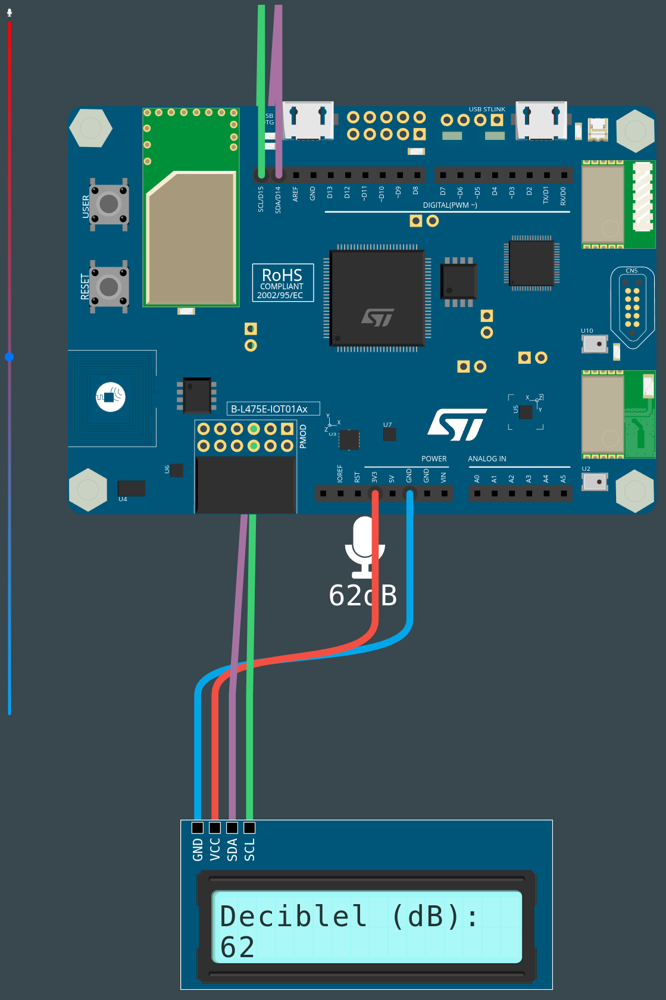

# PROG19-TDL-2

Nom de la fiche: Afficher les données sur un écran
Id protocole: PR19-TDL
Nom du protocole: Peut-on mesurer l'atténuation du son par un matériau ? (https://www.notion.so/Peut-on-mesurer-l-att-nuation-du-son-par-un-mat-riau-179504d5b5b74224b7163463442e1985?pvs=21)
Lié à Protocoles d’expérimentation (1) (Fiches programmation): Sans titre (https://www.notion.so/f6ad1c138c25443ba572256f1fcdb0ad?pvs=21)

🛠️**Construire**

**Connecter l'écran**

Pour connecter l'écran LCD, nous allons utiliser le bus I2C avec la convention suivante :

- Noir pour GND (GND)
- Rouge pour VCC (5V)
- Violet pour SDA (D14)
- Vert pour SCL (D15)

*Ressources : [https://en.wikipedia.org/wiki/I2C](https://en.wikipedia.org/wiki/I2C), [https://en.wikipedia.org/wiki/Serial_Peripheral_Interface](https://en.wikipedia.org/wiki/Serial_Peripheral_Interface), [https://www.sparkfun.com/qwiic](https://www.sparkfun.com/qwiic), [https://learn.adafruit.com/introducing-adafruit-stemmaqt/what-is-stemma-qt](https://learn.adafruit.com/introducing-adafruit-stemmaqt/what-is-stemma-qt)*

**Connecter la carte à l'ordinateur**

Avec votre câble USB, connectez la carte à votre ordinateur en utilisant le connecteur micro-USB ST-LINK (sur le coin en haut à droite de la carte). Si tout se passe bien, vous devriez voir apparaître sur votre ordinateur un nouveau lecteur appelé DIS_L4IOT. Ce lecteur est utilisé pour programmer la carte en copiant simplement un fichier binaire.

**Ouvrir MakeCode**

Allez dans l'éditeur MakeCode de Let's STEAM. Sur la page d'accueil, créez un nouveau projet en cliquant sur le bouton "Nouveau projet". Donnez à votre projet un nom plus expressif que "Sans titre" et lancez votre éditeur. *Ressource : [makecode.lets-steam.eu](http://makecode.lets-steam.eu/)*



**Installer les extensions**

Après avoir créé votre nouveau projet, vous obtiendrez l'écran par défaut "prêt à l'emploi" et vous devrez installer deux extensions.

<aside>
ℹ️ **Les extensions dans MakeCode sont des groupes de blocs de code qui ne sont pas directement inclus dans les blocs de code de base que l'on trouve dans MakeCode. Les extensions, comme leur nom l'indique, ajoutent des blocs pour des fonctionnalités spécifiques. Il existe des extensions pour un large éventail de fonctionnalités très utiles, ajoutant des capacités de manette de jeu, de clavier, de souris, de servomoteurs, de la robotique et bien plus encore.**

</aside>

Vous voyez le bouton noir **AVANCÉ** en bas de la colonne des différents groupes de blocs. Si vous cliquez sur **AVANCÉ**, vous verrez apparaître des groupes de blocs supplémentaires. En bas, il y a une boîte grise appelée **EXTENSIONS**. Cliquez sur ce bouton.

Dans la liste des extensions disponibles, vous pouvez facilement trouver l’extension **lcd_i2c** qui sera utilisée pour cette activité. L’extension **lcd_i2c** vous permettra d’afficher les données sur un écran. Si elle n’est pas directement disponible sur votre écran, vous pouvez les rechercher à l'aide de l'outil de recherche. Cliquez sur l’extension que vous souhaitez utiliser et un nouveau groupe de blocs apparaîtra sur l'écran principal.

**Programmer la carte**

Dans l'éditeur JavaScript de MakeCode, copiez/collez le code disponible dans la section "Programmer" ci-dessous. Si ce n'est pas déjà fait, pensez à donner un nom à votre projet et cliquez sur le bouton "Télécharger". Copiez le fichier binaire sur le lecteur DIS_L4IOT et attendez que la carte finisse de clignoter.

**Exécuter, modifier, jouer**

Votre programme s'exécutera automatiquement chaque fois que vous le sauvegarderez ou que vous réinitialiserez votre carte (appuyez sur le bouton intitulé RESET).

**🧑‍💻 Programmer**

```jsx
lcd_i2c.initScreen()
lcd_i2c.setCursor(0, 0);
lcd_i2c.ShowString("Deciblel (dB):")

forever(function () {
    lcd_i2c.setCursor(0, 1);
    lcd_i2c.ShowNumber(input.decibel());
    lcd_i2c.ShowString("   ");
    pause(200)
})
```