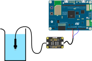

# PROG2-TDL-1

Nom de la fiche: Mesurer la conductivité de l’eau grâce à un conductimètre
Id protocole: PR2-TDL
Nom du protocole: Pourquoi l’océan est-il salé ? (https://www.notion.so/Pourquoi-l-oc-an-est-il-sal-223cdf893b5842f58ee86a0f1cfebdbd?pvs=21)
Lié à Protocoles d’expérimentation (1) (Fiches programmation): Sans titre (https://www.notion.so/879a6e40dba543bb931cd25f9996332f?pvs=21)

🛠️**Construire**

**Câbler le conductimètre**

Le conductimètre est composé de deux éléments :

1. La sonde (élément terminé par deux électrodes, qui sera plongé dans l’eau)
2. La carte d’acquisition (facilite la communication entre la STM32 et la sonde de mesure)

Le branchement de la sonde sur la carte d’acquisition se fait via le connecteur correspondant à la fiche de la sonde, qui ne comporte que deux broches.

Le lien avec la STM32 se fait via l’autre connecteur (avec trois broches), comme suit :

- Rouge sur 5V
- Noir sur GND
- Bleu sur A0

**Connecter la carte à l'ordinateur**

Avec votre câble USB, connectez la carte à votre ordinateur en utilisant le connecteur micro-USB ST-LINK (sur le coin en haut à droite de la carte). Si tout se passe bien, vous devriez voir apparaître sur votre ordinateur un nouveau lecteur appelé DIS_L4IOT. Ce lecteur est utilisé pour programmer la carte en copiant simplement un fichier binaire.

**Ouvrir MakeCode**

Allez dans l'éditeur MakeCode de Let's STEAM. Sur la page d'accueil, créez un nouveau projet en cliquant sur le bouton "Nouveau projet". Donnez à votre projet un nom plus expressif que "Sans titre" et lancez votre éditeur. *Ressource : [makecode.lets-steam.eu](http://makecode.lets-steam.eu/)*



**Installer les extensions**

Après avoir créé votre nouveau projet, vous obtiendrez l'écran par défaut "prêt à l'emploi" et vous devrez installer une extension.

<aside>
ℹ️ **Les extensions dans MakeCode sont des groupes de blocs de code qui ne sont pas directement inclus dans les blocs de code de base que l'on trouve dans MakeCode. Les extensions, comme leur nom l'indique, ajoutent des blocs pour des fonctionnalités spécifiques. Il existe des extensions pour un large éventail de fonctionnalités très utiles, ajoutant des capacités de manette de jeu, de clavier, de souris, de servomoteurs, de la robotique et bien plus encore.**

</aside>

Vous voyez le bouton noir **AVANCÉ** en bas de la colonne des différents groupes de blocs. Si vous cliquez sur **AVANCÉ**, vous verrez apparaître des groupes de blocs supplémentaires. En bas, il y a une boîte grise appelée **EXTENSIONS**. Cliquez sur ce bouton.

Dans la liste des extensions disponibles, vous pouvez trouver l’extension **ECMeter_SEN0244** qui sera utilisée pour cette activité. L’extension **ECMeter_SEN0244** vous permet de faire les mesures de conductivité de l’eau. Si elle n’est pas directement disponible sur votre écran, vous pouvez les rechercher à l'aide de l'outil de recherche. Cliquez sur l’extension que vous souhaitez utiliser et un nouveau groupe de blocs apparaîtra sur l'écran principal.

**Programmer la carte**

Dans l'éditeur JavaScript de MakeCode, copiez/collez le code disponible dans la section "Programmer" ci-dessous. Si ce n'est pas déjà fait, pensez à donner un nom à votre projet et cliquez sur le bouton "Télécharger". Copiez le fichier binaire sur le lecteur DIS_L4IOT et attendez que la carte finisse de clignoter.

**Exécuter, modifier, jouer**

Votre programme s'exécutera automatiquement chaque fois que vous le sauvegarderez ou que vous réinitialiserez votre carte (appuyez sur le bouton intitulé RESET). 

**🧑‍💻 Programmer**

```jsx
Serial.attachToConsole()

forever(function () {
    Serial.writeValue("EC", input.getECValue(pins.A0, ECUnit.US_CM))
    loops.pause(1000);
})
```