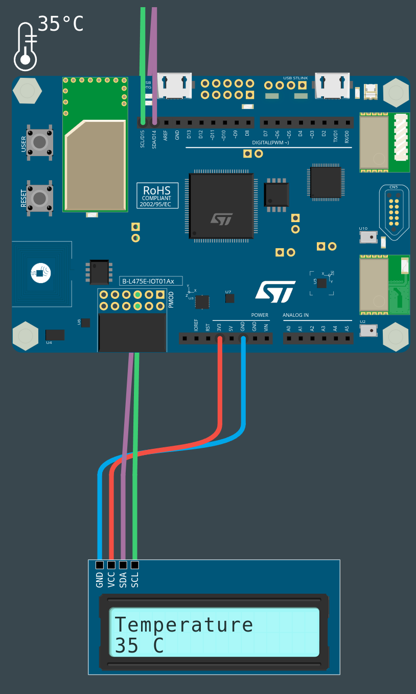

# PROG5-TDL-2

Nom de la fiche: Afficher les données collectées sur un écran
Id protocole: PR5-TDL
Nom du protocole: Comment pouvons-nous réduire la quantité d’énergie que nous utilisons ? (https://www.notion.so/Comment-pouvons-nous-r-duire-la-quantit-d-nergie-que-nous-utilisons-60dff23ace3b46a98d487e65ac55d9f3?pvs=21)
Lié à Protocoles d’expérimentation (1) (Fiches programmation): Sans titre (https://www.notion.so/a62c9e3b1e2143c3854049bad12e079f?pvs=21)

🛠️**Construire**

**Connecter l'écran à la carte**
Pour connecter l'écran LCD, nous allons utiliser le bus I2C avec la convention suivante :

- Noir pour GND (GND)
- Rouge pour VCC (5V)
- Violet pour SDA (D14)
- Vert pour SCL (D15)

**Connecter la carte à l'ordinateur**
Avec votre câble USB, connectez la carte à votre ordinateur en utilisant le connecteur micro-USB ST-LINK (sur le coin en haut à droite de la carte). Si tout se passe bien, vous devriez voir apparaître sur votre ordinateur un nouveau lecteur appelé DIS_L4IOT. Ce lecteur est utilisé pour programmer la carte en copiant simplement un fichier binaire.

**Ouvrir MakeCode**
Allez dans l'éditeur MakeCode de Let's STEAM. Sur la page d'accueil, créez un nouveau projet en cliquant sur le bouton "Nouveau projet". Donnez à votre projet un nom plus expressif que "Sans titre" et lancez votre éditeur. 

*Ressource : [makecode.lets-steam.eu](http://makecode.lets-steam.eu/)*

**Ajouter une extension**
Pour utiliser cet écran, il est nécessaire d’installer l’extension nommée ‘**lcd_i2c**’. Pour l’installer, cliquez sur l’icône en forme d’engrenage en haut à gauche de MakeCode, puis sélectionnez “**Extensions**”, une nouvelle fenêtre s’ouvre dans laquelle vous choisissez l’extension dont vous avez besoin en cliquant dessus, si vous ne la trouvez pas, vous pouvez utiliser la barre de recherche en haut de l’écran.

**Programmer la carte**
Dans l'éditeur JavaScript de MakeCode, copiez/collez le code disponible dans la section "Programmer" ci-dessous. Si ce n'est pas déjà fait, pensez à donner un nom à votre projet et cliquez sur le bouton "Télécharger". Copiez le fichier binaire sur le lecteur DIS_L4IOT et attendez que la carte finisse de clignoter.

**Exécuter, modifier, jouer**
Votre programme s'exécutera automatiquement chaque fois que vous le sauvegarderez ou que vous réinitialiserez votre carte (appuyez sur le bouton intitulé RESET). 



**🧑‍💻Programmer**

```jsx
lcd_i2c.initScreen()
lcd_i2c.ShowString("Temperature")

forever(function () {
    lcd_i2c.setCursor(0, 1)
    lcd_i2c.ShowString("" + convertToText(input.temperature(TemperatureUnit.Celsius)) + " C")
    pause(30000)
})
```