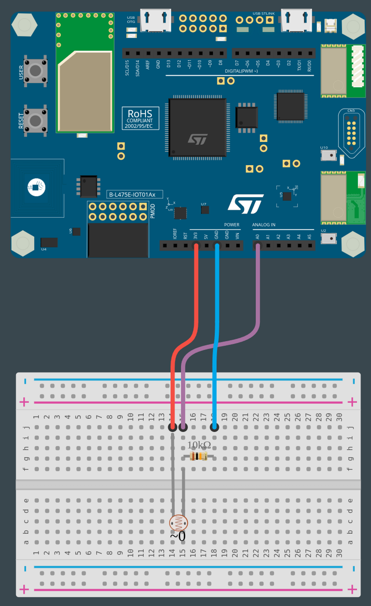

# PROG7-TDL-1

Nom de la fiche: Collecter des données grâce au capteur de lumière
Id protocole: PR7-TDL
Nom du protocole: Comment maximiser l’apport en énergie solaire et créer des panneaux auto-orientables ? (https://www.notion.so/Comment-maximiser-l-apport-en-nergie-solaire-et-cr-er-des-panneaux-auto-orientables-ef4207e8d25744a3abcf64ba472582b9?pvs=21)
Lié à Protocoles d’expérimentation (1) (Fiches programmation): Sans titre (https://www.notion.so/4f884ec45c4b456bbdd6a3eeb980f211?pvs=21)

🛠️ **Construire**

**Câbler la cellule photoélectrique**

Le circuit que nous devons assembler se compose de deux éléments : une résistance de 10 kΩ et une cellule photoélectrique.

<aside>
💡 La couleur des trois premières bandes indique la valeur de résistance du composant, selon un code connu sous le nom de "code couleur des résistances". La quatrième bande indique que la valeur de résistance est sujette à une tolérance (incertitude) qui peut être de 5% (si la bande est dorée) ou de 10% (si la bande est argentée) de la valeur de résistance nominale.

</aside>

<aside>
💡 Les photorésistances (alias LDR, cellule photoélectrique, ou cellule photoconductrice) sont des composants dont la résistance électrique varie en fonction de l'intensité de la lumière à laquelle ils sont exposés.

</aside>

La manière la plus simple de mesurer un capteur résistif est de connecter une extrémité à l'alimentation et l'autre à une résistance de rappel (pull-down) à la masse. Ensuite, le point situé entre la résistance de rappel et la cellule photoélectrique est connecté à l'entrée analogique d'un microcontrôleur. Un tel montage constitue ce que nous appelons un capteur analogique. Ce terme signifie que ce circuit est capable de capter une grandeur physique (à savoir l'intensité lumineuse) et de la transformer en une grandeur électrique proportionnelle (à savoir une tension dont la valeur est comprise entre 0 V et 3,3 V). Ces deux composants doivent être assemblés sur une breadboard, comme le montre l'image ci-contre.

**Installer l’extension serial**

Après avoir créé votre nouveau projet, vous obtiendrez l'écran par défaut "prêt à l'emploi" et vous devrez installer une extension.

<aside>
ℹ️ **Les extensions dans MakeCode sont des groupes de blocs de code qui ne sont pas directement inclus dans les blocs de code de base que l'on trouve dans MakeCode. Les extensions, comme leur nom l'indique, ajoutent des blocs pour des fonctionnalités spécifiques. Il existe des extensions pour un large éventail de fonctionnalités très utiles, ajoutant des capacités de manette de jeu, de clavier, de souris, de servomoteurs, de la robotique et bien plus encore.**

</aside>

Vous voyez le bouton noir **AVANCÉ** en bas de la colonne des différents groupes de blocs. Si vous cliquez sur **AVANCÉ**, vous verrez apparaître des groupes de blocs supplémentaires. En bas, il y a une boîte grise appelée **EXTENSIONS**. Cliquez sur ce bouton.

Dans la liste des extensions disponibles, vous pouvez facilement trouver l’extension **serial** qui sera utilisée pour cette activité. Cette extension vous permettra d’afficher les données relevées par le capteur de température dans la console. Si elle n’est pas directement disponible sur votre écran, vous pouvez la rechercher à l'aide de l'outil de recherche. Cliquez sur l’extension que vous souhaitez utiliser et un nouveau groupe de blocs apparaîtra sur l'écran principal. 

**Connecter la carte à l'ordinateur**
À l'aide de votre câble USB, connectez la carte à votre ordinateur en utilisant le connecteur micro-USB ST-LINK situé dans le coin supérieur droit de la carte. Si tout se passe bien, un nouveau lecteur appelé DIS_L4IOT apparaîtra sur votre ordinateur. Ce lecteur est utilisé pour programmer la carte en copiant simplement un fichier binaire.



**Ouvrir MakeCode**
Accédez à l'éditeur MakeCode de Let's STEAM. Sur la page d'accueil, créez un nouveau projet en cliquant sur le bouton "Nouveau projet". Donnez à votre projet un nom plus expressif que "Sans titre" et lancez votre éditeur.

*Ressource : [makecode.lets-steam.eu](http://makecode.lets-steam.eu/)*

**Programmer la carte**
Dans l'éditeur JavaScript de MakeCode, copiez/collez le code disponible dans la section "Programmer" ci-dessous. Si ce n'est pas déjà fait, pensez à donner un nom à votre projet et cliquez sur le bouton "Télécharger". Copiez le fichier binaire sur le lecteur DIS_L4IOT et attendez que la carte finisse de clignoter.

**Exécuter, modifier, jouer**
Votre programme s'exécutera automatiquement chaque fois que vous le sauvegarderez ou que vous réinitialiserez votre carte (cliquez sur le bouton RESET).

**🧑‍💻 Programmer**

```jsx
Serial.writeValue("LDR Left", pins.A0.analogRead())
    pause(1000)
})
```