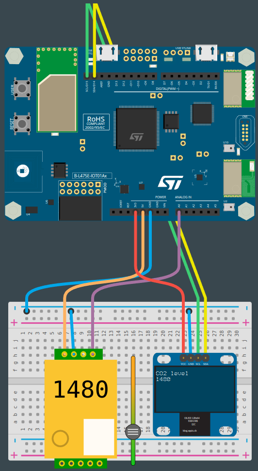

# PROG8-TDL-2

Nom de la fiche: Afficher les données collectées sur un écran
Id protocole: PR8-TDL
Nom du protocole: Une plante consomme-t-elle plus de CO2 qu’elle n’en rejette ? (https://www.notion.so/Une-plante-consomme-t-elle-plus-de-CO2-qu-elle-n-en-rejette-6390fd4c5ad848f7a2d037263e219518?pvs=21)
Lié à Protocoles d’expérimentation (1) (Fiches programmation): Sans titre (https://www.notion.so/59b525ae1be540169ac0e199575f1549?pvs=21)

🛠️**Construire**

**Connecter le capteur**

Pour ce montage, vous aurez besoin d’une breadboard.

Le capteur **mh-z19b** possède deux rangées de broches de part et d’autre du capteur : une de quatre broches, et une de cinq broches. Sur la rangée de quatre broches, 3 broches portent respectivement les mentions **PWM**, **GND** et **Vin**.

Vous allez devoir connecter les broches du capteur de la manière suivante :

- La broche **GND** du capteur à la bande d’alimentation '-' de la breadboard
- La broche **GND** de la carte à la bande d’alimentation '-' de la breadboard
- La broche **Vin** du capteur sur la broche **5V** de la carte
- La broche **PWM** du capteur sur la broche **A0** de la carte

<aside>
💡 **Les bandes de connexion '+' et '-' de la breadboard permettent de démultiplier le nombre de connexion simultanées aux broches d’alimentation de la carte. En effet, tous les trous de contact des bandes d’alimentation sont reliés, ce qui permet à plusieurs composants d’être alimentés en même temps en se branchant sur ces bandes.**

</aside>

**Connecter l’écran**

L’écran que vous allez utiliser est un écran OLED nommé **SSD1306**. Il peut être connecté soit en **SPI**, soit en **I2C**. Comme nous allons utiliser la communication **I2C**, vous allez devoir connecter l’écran de la manière suivante :

- La broche **GND** de l’écran à la bande d’alimentation '-' de la breadboard
- La broche **VCC** de l’écran sur la broche **3.3V** de la carte
- La broche **SDA** de l’écran sur la broche **D14** de la carte
- La broche **SCL** de l’écran sur la broche **D15** de la carte

*Ressources : [https://en.wikipedia.org/wiki/I2C](https://en.wikipedia.org/wiki/I2C), [https://en.wikipedia.org/wiki/Serial_Peripheral_Interface](https://en.wikipedia.org/wiki/Serial_Peripheral_Interface), [https://www.sparkfun.com/qwiic](https://www.sparkfun.com/qwiic), [https://learn.adafruit.com/introducing-adafruit-stemmaqt/what-is-stemma-qt](https://learn.adafruit.com/introducing-adafruit-stemmaqt/what-is-stemma-qt)*



**Connecter la carte à l'ordinateur**

Avec votre câble USB, connectez la carte à votre ordinateur en utilisant le connecteur micro-USB ST-LINK (sur le coin en haut à droite de la carte). Si tout se passe bien, vous devriez voir apparaître sur votre ordinateur un nouveau lecteur appelé DIS_L4IOT. Ce lecteur est utilisé pour programmer la carte en copiant simplement un fichier binaire.

**Ouvrir MakeCode**

Allez dans l'éditeur MakeCode de Let's STEAM. Sur la page d'accueil, créez un nouveau projet en cliquant sur le bouton "Nouveau projet". Donnez à votre projet un nom plus expressif que "Sans titre" et lancez votre éditeur. *Ressource : [makecode.lets-steam.eu](http://makecode.lets-steam.eu/)*

**Installer les extensions mh-z19b et OLED**

Après avoir créé votre nouveau projet, vous obtiendrez l'écran par défaut "prêt à l'emploi" et vous devrez installer deux extensions.

<aside>
ℹ️ **Les extensions dans MakeCode sont des groupes de blocs de code qui ne sont pas directement inclus dans les blocs de code de base que l'on trouve dans MakeCode. Les extensions, comme leur nom l'indique, ajoutent des blocs pour des fonctionnalités spécifiques. Il existe des extensions pour un large éventail de fonctionnalités très utiles, ajoutant des capacités de manette de jeu, de clavier, de souris, de servomoteurs, de la robotique et bien plus encore.**

</aside>

Vous voyez le bouton noir **AVANCÉ** en bas de la colonne des différents groupes de blocs. Si vous cliquez sur **AVANCÉ**, vous verrez apparaître des groupes de blocs supplémentaires. En bas, il y a une boîte grise appelée **EXTENSIONS**. Cliquez sur ce bouton.

Dans la liste des extensions disponibles, vous pouvez facilement trouver les extensions **mh-z19b** et **oled** qui seront utilisées pour cette activité. L’extension mh-z19b vous permettra d’interagir avec le capteur tandis que l’extension OLED vous permettra d’interagir avec l’écran. Si elles ne sont pas directement disponibles sur votre écran, vous pouvez les rechercher à l'aide de l'outil de recherche. Cliquez sur l’extension que vous souhaitez utiliser et un nouveau groupe de blocs apparaîtra sur l'écran principal. 

**Programmer la carte**

Dans l'éditeur JavaScript de MakeCode, copiez/collez le code disponible dans la section "Programmer" ci-dessous. Si ce n'est pas déjà fait, pensez à donner un nom à votre projet et cliquez sur le bouton "Télécharger". Copiez le fichier binaire sur le lecteur DIS_L4IOT et attendez que la carte finisse de clignoter.

**Exécuter, modifier, jouer**

Votre programme s'exécutera automatiquement chaque fois que vous le sauvegarderez ou que vous réinitialiserez votre carte (appuyez sur le bouton intitulé RESET). Pour observer la concentration de CO2 dans l’air, regardez l’écran OLED qui devrait afficher la valeur en ppm.

**🧑‍💻Programmer**

```jsx
forever(function () {
    oled.clear()
    oled.showString("CO2 level", 1)
    oled.showNumber(input.getCO2Concentration(pins.A0), 2)
		pause(500)
})
```