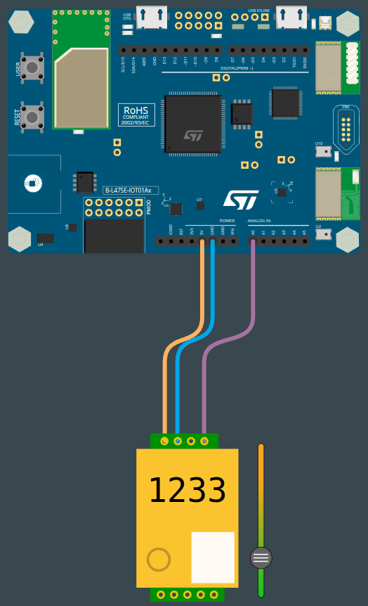

# PROG8-TDL-3

Nom de la fiche: Exporter les données de la carte au format CSV
Id protocole: PR8-TDL
Nom du protocole: Une plante consomme-t-elle plus de CO2 qu’elle n’en rejette ? (https://www.notion.so/Une-plante-consomme-t-elle-plus-de-CO2-qu-elle-n-en-rejette-6390fd4c5ad848f7a2d037263e219518?pvs=21)
Lié à Protocoles d’expérimentation (1) (Fiches programmation): Sans titre (https://www.notion.so/59b525ae1be540169ac0e199575f1549?pvs=21)

🛠️**Construire**

**Câbler le capteur de CO2**

Le capteur **mh-z19b** possède deux rangées de broches de part et d’autre du capteur : une de quatre broches, et une de cinq broches. Sur la rangée de quatre broches, 3 broches portent respectivement les mentions **PWM**, **GND** et **Vin**.

Vous allez devoir connecter les broches du capteur de la manière suivante :

- La broche **GND** du capteur sur la broche **GND** de la carte
- La broche **Vin** du capteur sur la broche **5V** de la carte
- La broche **PWM** du capteur sur la broche **A0** de la carte



**Connecter la carte à l'ordinateur**

Avec votre câble USB, connectez la carte à votre ordinateur en utilisant le connecteur micro-USB ST-LINK (sur le coin en haut à droite de la carte). Si tout se passe bien, vous devriez voir apparaître sur votre ordinateur un nouveau lecteur appelé DIS_L4IOT. Ce lecteur est utilisé pour programmer la carte en copiant simplement un fichier binaire.

**Ouvrir MakeCode**

Allez dans l'éditeur MakeCode de Let's STEAM. Sur la page d'accueil, créez un nouveau projet en cliquant sur le bouton "Nouveau projet". Donnez à votre projet un nom plus expressif que "Sans titre" et lancez votre éditeur. *Ressource : [makecode.lets-steam.eu](http://makecode.lets-steam.eu/)*

**Installer les extensions mh-z19b et datalogger**

Après avoir créé votre nouveau projet, vous obtiendrez l'écran par défaut "prêt à l'emploi" et vous devrez installer deux extensions.

<aside>
ℹ️ **Les extensions dans MakeCode sont des groupes de blocs de code qui ne sont pas directement inclus dans les blocs de code de base que l'on trouve dans MakeCode. Les extensions, comme leur nom l'indique, ajoutent des blocs pour des fonctionnalités spécifiques. Il existe des extensions pour un large éventail de fonctionnalités très utiles, ajoutant des capacités de manette de jeu, de clavier, de souris, de servomoteurs, de la robotique et bien plus encore.**

</aside>

Vous voyez le bouton noir **AVANCÉ** en bas de la colonne des différents groupes de blocs. Si vous cliquez sur **AVANCÉ**, vous verrez apparaître des groupes de blocs supplémentaires. En bas, il y a une boîte grise appelée **EXTENSIONS**. Cliquez sur ce bouton.

Dans la liste des extensions disponibles, vous pouvez facilement trouver les extensions nommées **mh-z19b** et **datalogger**. L’extension mh-z19b vous permettra d’interagir avec le capteur, tandis que l’extension datalogger ****vous permettra de récupérer les données récoltées par la carte au format CSV. Si les extensions ne sont pas directement disponibles sur votre écran, vous pouvez les rechercher à l'aide de l'outil de recherche. Cliquez sur l’extension que vous souhaitez utiliser et un nouveau groupe de blocs apparaîtra sur l'écran principal.

**Programmer la carte**

Dans l'éditeur JavaScript de MakeCode, copiez/collez le code disponible dans la section "Programmer" ci-dessous. Si ce n'est pas déjà fait, pensez à donner un nom à votre projet et cliquez sur le bouton "Télécharger". Copiez le fichier binaire sur le lecteur DIS_L4IOT et attendez que la carte finisse de clignoter.

**Exécuter, modifier, jouer**

Votre programme s'exécutera automatiquement chaque fois que vous le sauvegarderez ou que vous réinitialiserez votre carte (appuyez sur le bouton intitulé RESET). Le programme va, tous les jours, ajouter une ligne qui va contenir la valeur de CO2 mesurée la journée puis attendre 12 heures avant de faire une nouvelle mesure pour la nuit. Il est donc conseillé de lancer le programme vers midi, car ainsi il est assuré qu’il y ait une alternance de jour et de nuit entre les différentes mesures.

**🧑‍💻Programmer**

```jsx
datalogger.setEnabled(true)
forever(function () {
    datalogger.addValue("jour", input.getCO2Concentration(pins.A0))
    pause(43200000)
    datalogger.addValue("nuit", input.getCO2Concentration(pins.A0))
    datalogger.addRow()
    pause(43200000)
})
```

<aside>
💡 **La fonction pause demande un temps d’attente exprimé en millisecondes. Comme nous faisons un relevé toutes les douze heures, il faut convertir 12 heures en millisecondes, soit 12 x 60 x 60 x 1 000 = 43200000 ms.**

</aside>